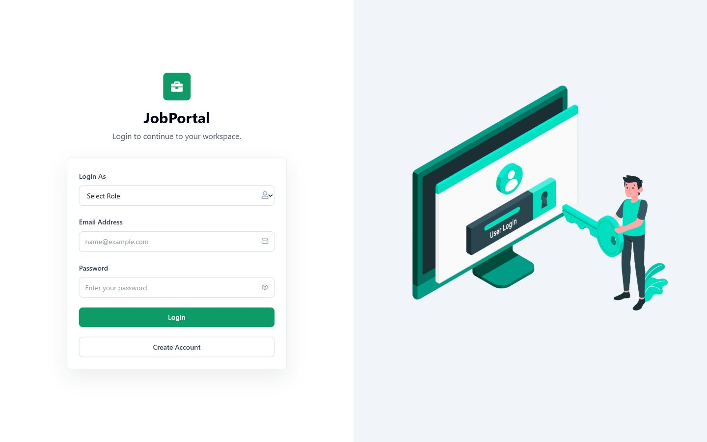
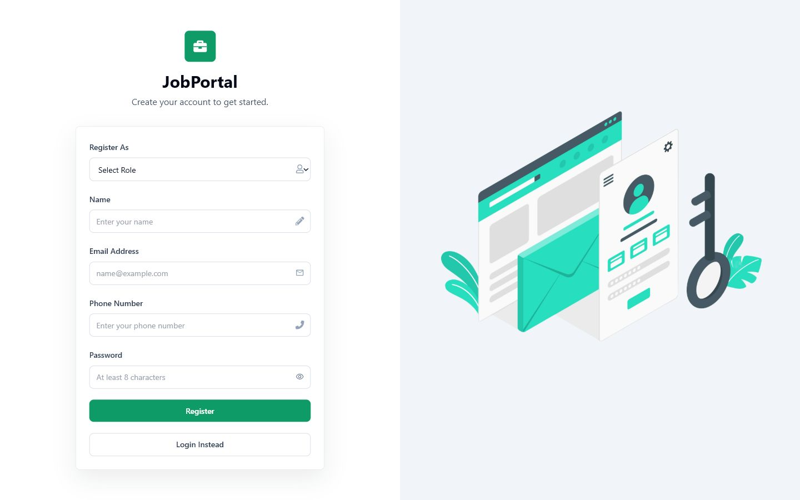
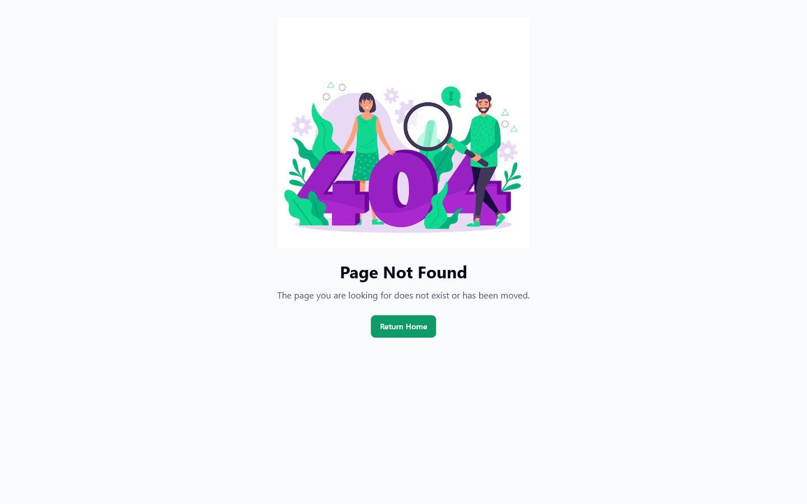
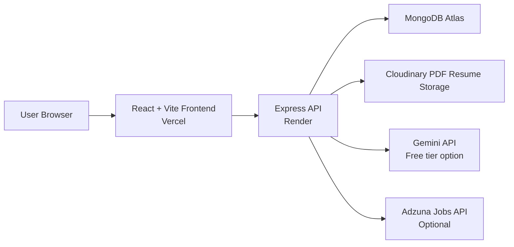

# JobPortal - MERN Stack Job Portal Application

Developer: **Saurav Satpute**

JobPortal is a full-stack job portal application built with MongoDB, Express.js, React.js, and Node.js. It supports role-based workflows for job seekers and employers, job posting, job search and filtering, resume upload, application status tracking, dashboards, Cloudinary file storage, and production deployment on Vercel and Render.

## Live Deployment

- Frontend: [https://job-portal-blue-six.vercel.app](https://job-portal-blue-six.vercel.app)
- Backend API: [https://job-portal-ftw4.onrender.com](https://job-portal-ftw4.onrender.com)
- Backend health check: [https://job-portal-ftw4.onrender.com/api/v1/health](https://job-portal-ftw4.onrender.com/api/v1/health)
- Repository branch: `main`

Render free services can sleep after inactivity. The first request after a sleep can take extra time.

## Screenshots

### Login



### Register



### 404 Page



### Authenticated Screens To Add

The following pages require a valid login session, so screenshots should be captured after creating test accounts:

- Job seeker home dashboard
- Job search and filters page
- Job seeker applications dashboard
- Profile and resume upload page
- Employer dashboard
- Employer posted jobs page
- Employer applications/status management page
- AI Career Assistant page
- External jobs page

Suggested file names:

```text
docs/screenshots/home-dashboard.png
docs/screenshots/jobs-filter.png
docs/screenshots/jobseeker-dashboard.png
docs/screenshots/profile-resume.png
docs/screenshots/employer-dashboard.png
docs/screenshots/employer-applications.png
docs/screenshots/ai-assistant.png
docs/screenshots/external-jobs.png
```

## What The App Does

JobPortal has two user roles:

- Job Seekers can register, log in, browse jobs, filter jobs, apply with a resume, upload a resume to their profile, track application statuses, and manage submitted applications.
- Employers can register, log in, create jobs, manage posted jobs, view applicants, open applicant resumes, update application statuses, and see employer dashboard statistics.

## Core Features

- Role-based authentication for `Job Seeker` and `Employer`.
- JWT authentication stored in secure HTTP cookies.
- Protected frontend routes that redirect unauthenticated users to login.
- Job posting and management for employers.
- Job browsing with keyword search by title, category, description, city, country, or location.
- Real-time frontend filters for job type, location, and salary range.
- Backend filtering, pagination, and active-job filtering.
- PDF resume upload for job seekers.
- Resume storage on Cloudinary.
- Reuse profile resume while applying, or upload a resume during the application flow.
- Employer-side resume links while reviewing applications.
- Application statuses: `Pending`, `Shortlisted`, and `Rejected`.
- Job seeker dashboard with total applications and status counts.
- Employer dashboard with total jobs posted and total applications received.
- AI Career Assistant for job-fit scoring, resume tips, gaps, next steps, and interview questions.
- AI resume analyzer with PDF text extraction, resume score, strengths, issues, and keyword suggestions.
- AI job match scores on job cards for signed-in job seekers.
- AI cover letter generator from the application form.
- AI skill gap roadmap and interview question generator from job details.
- Employer AI candidate summary for received applications.
- Employer AI job description generator while posting jobs.
- External live jobs integration through Adzuna API.
- Tailwind CSS UI.
- Responsive navbar with `JobPortal` branding.
- Loading spinners for API calls.
- Toast notifications with `react-hot-toast`.
- Input validation in frontend forms and backend routes.
- Centralized backend error handling.
- 404 page for unknown frontend routes.
- Production deployment configuration for Render and Vercel.
- GitHub Actions CI for frontend and backend checks.

## Tech Stack

| Layer | Technologies |
| --- | --- |
| Frontend | React 18, Vite, React Router, Tailwind CSS, Axios, React Icons, react-hot-toast |
| Backend | Node.js, Express.js, Mongoose, JWT, bcrypt, validator |
| Database | MongoDB Atlas or local MongoDB |
| File Uploads | express-fileupload, Cloudinary, pdf-parse |
| AI | Gemini API free tier, smart fallback advisor |
| External Jobs | Adzuna Jobs API, optional |
| Deployment | Vercel for frontend, Render for backend |
| DevOps | Docker, Docker Compose, GitHub Actions |

## Architecture



## Project Structure

```text
.
|-- backend
|   |-- constants
|   |-- controllers
|   |-- database
|   |-- middlewares
|   |-- models
|   |-- routes
|   |-- services
|   |-- utils
|   |-- Dockerfile
|   |-- app.js
|   |-- server.js
|   `-- .env.example
|-- frontend
|   |-- public
|   |-- src
|   |   |-- components
|   |   |-- constants
|   |   `-- utils
|   |-- Dockerfile
|   |-- nginx.conf
|   |-- vercel.json
|   `-- .env.example
|-- docs
|   `-- screenshots
|-- .github
|   `-- workflows
|-- docker-compose.yml
|-- render.yaml
`-- README.md
```

## Local Setup

### Prerequisites

- Node.js 22.x recommended.
- npm.
- MongoDB Atlas database or local MongoDB.
- Cloudinary account for resume uploads.
- Optional Adzuna developer credentials for live external jobs.
- Docker Desktop, only if using the containerized setup.

### 1. Clone The Repository

```sh
git clone https://github.com/sgsatpute/Job-portal.git
cd Job-portal
```

### 2. Backend Setup

```sh
cd backend
npm install
```

Create `backend/.env` or `backend/config/config.env`.

```env
PORT=4000
NODE_ENV=development
FRONTEND_URL=http://localhost:5173
DB_URL=mongodb://127.0.0.1:27017/jobportal
DB_NAME=Job_Portal
JWT_SECRET_KEY=replace-with-a-long-random-secret
JWT_EXPIRE=7d
COOKIE_EXPIRE=7
COOKIE_SAME_SITE=lax
COOKIE_SECURE=false
ENABLE_CSRF=false
CLOUDINARY_CLOUD_NAME=your-cloudinary-cloud-name
CLOUDINARY_API_KEY=your-cloudinary-api-key
CLOUDINARY_API_SECRET=your-cloudinary-api-secret
ADZUNA_APP_ID=optional-adzuna-app-id
ADZUNA_APP_KEY=optional-adzuna-app-key
ADZUNA_COUNTRY=in
GEMINI_API_KEY=optional-free-gemini-api-key
GEMINI_MODEL=gemini-2.5-flash
```

Start the backend:

```sh
npm run dev
```

Backend should run on:

```text
http://localhost:4000
```

Health check:

```text
http://localhost:4000/api/v1/health
```

### 3. Frontend Setup

Open a second terminal:

```sh
cd frontend
npm install
```

Create `frontend/.env`.

```env
VITE_API_URL=http://localhost:4000/api/v1
```

Start the frontend:

```sh
npm run dev
```

Frontend should run on:

```text
http://localhost:5173
```

### 4. Docker Setup

Docker Compose starts the frontend, backend, MongoDB, and Redis together:

```sh
docker compose up --build
```

Container URLs:

```text
Frontend: http://localhost:5173
Backend:  http://localhost:4000
MongoDB:  mongodb://localhost:27017/jobportal
Redis:    localhost:6379
```

The Docker setup uses local placeholder secrets and optional AI/external-job settings. For real demos, set Gemini, Adzuna, and Cloudinary credentials through environment variables or a compose override file instead of committing secrets.

## Demo Flow

### Job Seeker Flow

1. Register as `Job Seeker`.
2. Log in with the same role.
3. Upload a PDF resume from the profile page.
4. Browse jobs.
5. Search by keyword and filter by job type, location, and salary range.
6. Open a job and submit an application.
7. Open the applications dashboard to track `Pending`, `Shortlisted`, or `Rejected` status.

### Employer Flow

1. Register as `Employer`.
2. Log in with the same role.
3. Complete employer profile/company details.
4. Post jobs.
5. Review posted jobs and application counts.
6. Open applications, view applicant resume links, and update application status.
7. Use the employer dashboard to review totals.

## API Overview

Base URL:

```text
http://localhost:4000/api/v1
```

Production base URL:

```text
https://job-portal-ftw4.onrender.com/api/v1
```

### Health

| Method | Route | Description |
| --- | --- | --- |
| GET | `/health` | API health check |

### User Routes

| Method | Route | Auth | Description |
| --- | --- | --- | --- |
| POST | `/user/register` | Public | Register job seeker or employer |
| POST | `/user/login` | Public | Login and receive auth cookie |
| GET | `/user/logout` | Public | Clear auth cookie |
| GET | `/user/getuser` | Required | Get current user |
| PUT | `/user/profile` | Required | Update profile or company details |
| PUT | `/user/resume` | Job Seeker | Upload PDF resume |

### Job Routes

| Method | Route | Auth | Description |
| --- | --- | --- | --- |
| GET | `/job/getall` | Public API | Get active jobs with search, filters, and pagination |
| POST | `/job/post` | Employer | Post a new job |
| GET | `/job/getmyjobs` | Employer | Get employer jobs |
| GET | `/job/employer/dashboard` | Employer | Get employer dashboard stats |
| PUT | `/job/update/:id` | Employer | Update own job |
| DELETE | `/job/delete/:id` | Employer | Delete own job |
| GET | `/job/:id` | Required | Get single job |

Supported `/job/getall` query parameters:

```text
search=developer
jobType=Full-time
location=Pune, India
salaryRange=30000-60000
page=1
limit=9
```

### Application Routes

| Method | Route | Auth | Description |
| --- | --- | --- | --- |
| POST | `/application/post` | Job Seeker | Submit application |
| GET | `/application/employer/getall` | Employer | Get received applications |
| PUT | `/application/employer/status/:id` | Employer | Update application status |
| GET | `/application/jobseeker/dashboard` | Job Seeker | Get dashboard stats |
| GET | `/application/jobseeker/getall` | Job Seeker | Get own applications |
| DELETE | `/application/delete/:id` | Job Seeker | Delete own application |

### External Jobs

| Method | Route | Auth | Description |
| --- | --- | --- | --- |
| GET | `/external-jobs/search` | Required | Search live jobs from Adzuna |

### AI Routes

| Method | Route | Auth | Description |
| --- | --- | --- | --- |
| POST | `/ai/career-advice` | Required | Generate job-fit advice, resume tips, next steps, and interview questions |
| POST | `/ai/resume-analysis` | Job Seeker | Analyze uploaded PDF resume text |
| GET | `/ai/job-match/:id` | Job Seeker | Generate a quick or provider-backed job match score |
| POST | `/ai/cover-letter/:id` | Job Seeker | Generate a cover letter for a job |
| GET | `/ai/interview-questions/:id` | Required | Generate job-specific interview questions |
| GET | `/ai/skill-roadmap/:id` | Job Seeker | Generate a skill gap roadmap |
| GET | `/ai/application-summary/:id` | Employer | Summarize a candidate application |
| POST | `/ai/job-description` | Employer | Generate a job description draft |

For job card match scores, `/ai/job-match/:id` uses the built-in smart matcher by default. Add `?generate=true` for a Gemini-backed match report from the job detail page.

Supported query parameters:

```text
search=software developer
location=Pune
page=1
limit=10
```

## Live Jobs API

The project includes an optional Adzuna integration for live external job data. Adzuna provides a developer jobs API with a free access tier suitable for portfolio/demo usage.

Required backend variables:

```env
ADZUNA_APP_ID=your-adzuna-app-id
ADZUNA_APP_KEY=your-adzuna-app-key
ADZUNA_COUNTRY=in
```

External jobs are not stored in MongoDB by default. They are fetched from Adzuna and shown as external results with source links.

## AI Placement Tools

The project includes an AI Career Assistant page at:

```text
/ai-assistant
```

It helps users review their fit for a target role or a selected job. It returns:

- Job-fit score.
- Strengths.
- Missing skills or weak areas.
- Resume improvement tips.
- Next steps before applying.
- Interview questions to prepare.

Additional AI features are integrated into the user workflows:

- Resume analyzer on the job seeker dashboard.
- Match score on job cards and a deeper match report on job details.
- Cover letter generator on the application form.
- Skill roadmap and interview questions on job details.
- Candidate summary on the employer applications page.
- Job description generator on the employer post job page.

The free setup is Gemini API from Google AI Studio. If `GEMINI_API_KEY` is configured on the backend, the assistant uses Gemini. If Gemini is not configured or the provider is unavailable, it falls back to the built-in smart advisor so the page still works in demos.

Recommended free backend variables:

```env
GEMINI_API_KEY=your-free-gemini-api-key
GEMINI_MODEL=gemini-2.5-flash
```

## Deployment Guide

### Backend On Render

Create a **Web Service**, not a private service.

Recommended Render settings:

| Setting | Value |
| --- | --- |
| Root Directory | `backend` |
| Runtime | `Node` |
| Branch | `main` |
| Build Command | `npm install` |
| Start Command | `npm start` |
| Health Check Path | `/api/v1/health` |

Backend environment variables:

```env
PORT=4000
NODE_ENV=production
FRONTEND_URL=https://job-portal-blue-six.vercel.app
DB_URL=your-mongodb-atlas-url
DB_NAME=Job_Portal
JWT_SECRET_KEY=your-production-jwt-secret
JWT_EXPIRE=7d
COOKIE_EXPIRE=7
COOKIE_SAME_SITE=none
COOKIE_SECURE=true
ENABLE_CSRF=false
CLOUDINARY_CLOUD_NAME=your-cloudinary-cloud-name
CLOUDINARY_API_KEY=your-cloudinary-api-key
CLOUDINARY_API_SECRET=your-cloudinary-api-secret
ADZUNA_APP_ID=optional-adzuna-app-id
ADZUNA_APP_KEY=optional-adzuna-app-key
ADZUNA_COUNTRY=in
GEMINI_API_KEY=optional-free-gemini-api-key
GEMINI_MODEL=gemini-2.5-flash
```

Important:

- `FRONTEND_URL` must be the deployed Vercel URL.
- `COOKIE_SAME_SITE` must be `none` for cross-site Vercel to Render cookies.
- `COOKIE_SECURE` must be `true` in production.
- MongoDB Atlas must allow Render to connect. For a demo, Atlas Network Access is often set to `0.0.0.0/0`.

### Frontend On Vercel

Create a Vercel project using only the `frontend` directory.

Recommended Vercel settings:

| Setting | Value |
| --- | --- |
| Framework Preset | `Vite` |
| Root Directory | `frontend` |
| Build Command | `npm run build` |
| Output Directory | `dist` |
| Install Command | `npm install` |

Frontend environment variable:

```env
VITE_API_URL=https://job-portal-ftw4.onrender.com/api/v1
```

After Vercel deploys, update Render `FRONTEND_URL` to the final Vercel production URL and redeploy the backend.

## Security Notes

- Never commit real `.env` files.
- Rotate MongoDB, Cloudinary, JWT, Adzuna, and Gemini credentials if they were ever exposed in Git history.
- Use long random values for `JWT_SECRET_KEY`.
- Keep production cookies secure with `COOKIE_SECURE=true`.
- Keep `COOKIE_SAME_SITE=none` only when frontend and backend are hosted on different domains.
- Review MongoDB Atlas Network Access before using this for anything beyond a demo.
- Render free instances can sleep, so production demos may have a cold-start delay.
- Rotate AI provider keys immediately if they are ever pasted into chat, screenshots, or Git history.

## Validation And Error Handling

The backend validates:

- Required registration and login fields.
- Email format.
- Role values.
- Password length.
- Phone number format.
- Job type values.
- Salary range consistency.
- Job ownership for update/delete.
- Application ownership for delete.
- Employer ownership for status updates.
- PDF-only resume uploads.
- Resume file size up to 5MB.

The frontend uses protected routes, toast notifications, loading states, form validation, and API error messages.

## Run Checks

Frontend:

```sh
cd frontend
npm run lint
npm run build
npm audit --omit=dev --audit-level=high
```

Backend:

```sh
cd backend
npm install
npm audit --audit-level=high
npm start
```

CI is configured through GitHub Actions in:

```text
.github/workflows/ci.yml
```

The CI pipeline runs frontend lint/build, dependency audits, backend syntax checks, and Docker image builds.

## Troubleshooting

### Login Or Register Shows API Error

Check:

- Backend Render service is running.
- `VITE_API_URL` on Vercel points to `https://job-portal-ftw4.onrender.com/api/v1`.
- `FRONTEND_URL` on Render points to the exact Vercel frontend URL.
- `COOKIE_SAME_SITE=none` and `COOKIE_SECURE=true` in production.
- MongoDB Atlas connection string is valid.

### Resume Upload Fails

Check:

- Cloudinary credentials are correct.
- File is a PDF.
- File size is 5MB or less.
- Backend has `CLOUDINARY_CLOUD_NAME`, `CLOUDINARY_API_KEY`, and `CLOUDINARY_API_SECRET`.

### External Jobs Do Not Load

Check:

- `ADZUNA_APP_ID` and `ADZUNA_APP_KEY` are set on Render.
- `ADZUNA_COUNTRY` is valid, for example `in`.
- The backend was redeployed after adding environment variables.

### AI Assistant Uses Smart Advisor Instead Of Gemini

Check:

- `GEMINI_API_KEY` is set on Render backend.
- `GEMINI_MODEL` is valid, for example `gemini-2.5-flash`.
- The backend was redeployed after adding or changing Gemini variables.
- The Gemini API key is active in Google AI Studio and has available free-tier quota.

### Vercel 404 On Refresh

The frontend includes `frontend/vercel.json` with a rewrite to `index.html`. Make sure Vercel is deploying from the `frontend` root directory.

## Roadmap Ideas

- Admin panel for monitoring users, jobs, and applications.
- Saved jobs for job seekers.
- Employer applicant notes.
- Email notifications for shortlisted/rejected status.
- Job recommendation engine.
- Public landing page that does not require login.
- Seed script for demo users and demo jobs.
- More screenshots for authenticated workflows.

## Developer

Developed by **Saurav Satpute**.

## License

This project is for learning, portfolio, and placement-readiness demonstration purposes. Add a formal license file if you plan to distribute or reuse it publicly.
