# JobPortal Learning Guide For Placement Preparation

Developer: Saurav Satpute

This file is for learning and interview preparation. It does not change the project code.

Use this guide to understand the project from zero, explain it in interviews, and prepare resume points honestly.

---

## 1. Project In One Line

JobPortal is a MERN stack job portal where:

- Job seekers can register, login, search and save jobs, upload resumes, apply for jobs, track application status, view interview schedules, receive notifications, and use AI placement tools.
- Employers can register, login, post jobs, view applications, open resumes, update status, schedule or cancel interviews, receive notifications, use analytics, and use AI to summarize candidates.

The app is deployed with:

- Frontend: Vercel
- Backend: Render
- Database: MongoDB Atlas
- Resume storage: Cloudinary
- AI: Gemini API free tier
- External jobs: Adzuna API
- Real-time notifications: Socket.IO
- Optional background jobs and email: BullMQ, Redis, Nodemailer

---

## 2. The Big Picture

### Visual Architecture

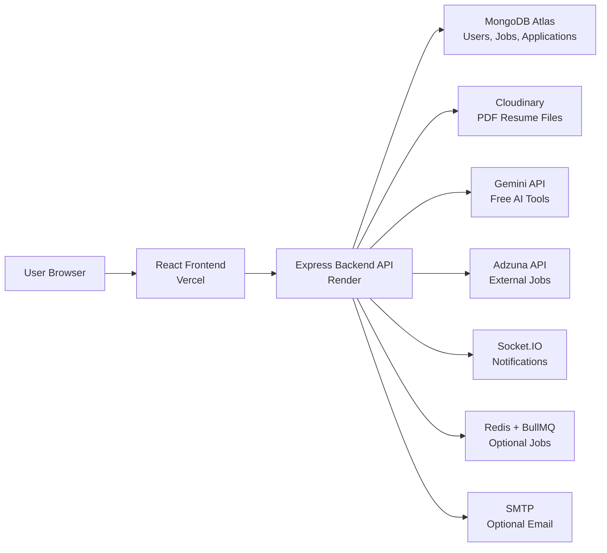

### Simple Explanation

The frontend is what the user sees.

The backend is the server that receives requests, checks login, talks to the database, uploads resumes, and calls APIs.

MongoDB stores app data.

Cloudinary stores PDF files.

Gemini gives AI responses.

Adzuna gives live external jobs.

Socket.IO sends real-time notifications.

Redis/BullMQ and SMTP are optional production-style services for background email delivery.

---

## 3. What MERN Means

MERN means:

| Letter | Meaning | Use In This Project |
| --- | --- | --- |
| M | MongoDB | Stores users, jobs, applications |
| E | Express.js | Creates backend API routes |
| R | React.js | Builds frontend pages/components |
| N | Node.js | Runs the backend server |

Interview answer:

> MERN is a full-stack JavaScript stack. React handles the frontend, Express and Node handle the backend API, and MongoDB stores data.

---

## 4. Folder Structure

```text
job portal/
  frontend/
    src/
      components/
      utils/
      constants/
    package.json
    vercel.json

  backend/
    controllers/
    routes/
    models/
    middlewares/
    services/
    constants/
    app.js
    server.js

  docs/
    PROJECT_LEARNING_GUIDE.md

  README.md
  render.yaml
```

### What Each Backend Folder Means

| Folder/File | Meaning |
| --- | --- |
| `backend/server.js` | Starts the backend server |
| `backend/app.js` | Sets up Express, CORS, cookies, routes, file upload |
| `backend/routes/` | Defines API URLs |
| `backend/controllers/` | Contains main logic for each route |
| `backend/models/` | Defines MongoDB schemas |
| `backend/middlewares/` | Common checks like login and error handling |
| `backend/services/` | Reusable helper logic like resume upload |
| `backend/constants/` | Fixed values like roles, statuses, job types |

### What Each Frontend Folder Means

| Folder/File | Meaning |
| --- | --- |
| `frontend/src/App.jsx` | Defines frontend routes/pages |
| `frontend/src/main.jsx` | Starts React app |
| `frontend/src/components/` | UI pages and reusable components |
| `frontend/src/utils/api.js` | Axios API setup |
| `frontend/src/constants/` | Fixed frontend options |

---

## 5. Request Lifecycle

Whenever the user clicks something, this usually happens:

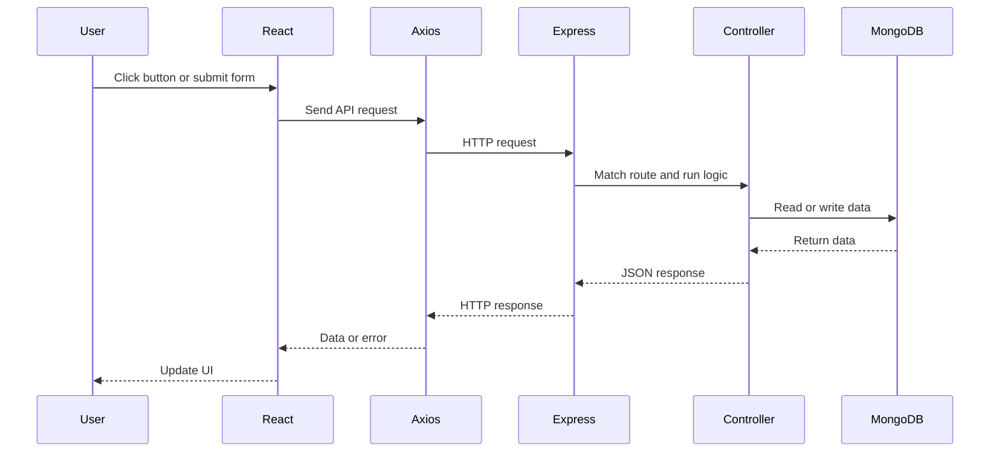

Example:

When a job seeker applies for a job:

1. User fills the application form.
2. React sends data to backend.
3. Backend checks if user is logged in.
4. Backend checks if job exists.
5. Backend saves application in MongoDB.
6. Frontend shows success toast.

---

## 6. Important Concepts You Must Know

### API

API means Application Programming Interface.

In this project, API means backend URLs that frontend calls.

Example:

```text
POST /api/v1/user/login
GET /api/v1/job/getall
POST /api/v1/application/post
```

Interview answer:

> The frontend does not directly access MongoDB. It calls backend API endpoints, and the backend performs database operations.

### Route

A route is an API path.

Example:

```js
router.post("/login", login);
```

This means:

```text
POST /api/v1/user/login
```

calls the `login` controller.

### Controller

A controller contains the actual backend logic.

Example:

`userController.js` handles:

- register
- login
- logout
- get user
- update profile
- upload resume

### Model

A model defines what data looks like in MongoDB.

Example:

User model defines:

- name
- email
- phone
- password
- role
- resume
- profile

### Middleware

Middleware runs before the controller.

Example:

`isAuthenticated` checks if the user is logged in before allowing protected routes.

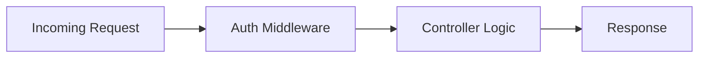

### JWT

JWT means JSON Web Token.

It proves that the user is logged in.

Flow:

1. User logs in.
2. Backend creates JWT.
3. JWT is stored in an HTTP-only cookie.
4. For protected routes, backend reads cookie and verifies JWT.

### HTTP-only Cookie

A cookie stores the login token in the browser.

HTTP-only means JavaScript cannot read it directly. This is safer than storing tokens in localStorage.

### bcrypt

bcrypt is used to hash passwords.

The app never stores the real password. It stores a hashed password.

Example:

```text
Real password: Saurav123
Stored password: $2b$10$...
```

### CORS

CORS controls which frontend domains can call the backend.

Why needed:

Frontend is on Vercel.

Backend is on Render.

They are different domains, so backend must allow frontend origin.

### Environment Variables

Environment variables store secrets and configuration.

Examples:

```text
DB_URL
JWT_SECRET_KEY
CLOUDINARY_API_SECRET
GEMINI_API_KEY
ADZUNA_APP_KEY
```

Never commit real secrets to GitHub.

---

## 7. Authentication Flow

### Login Visual

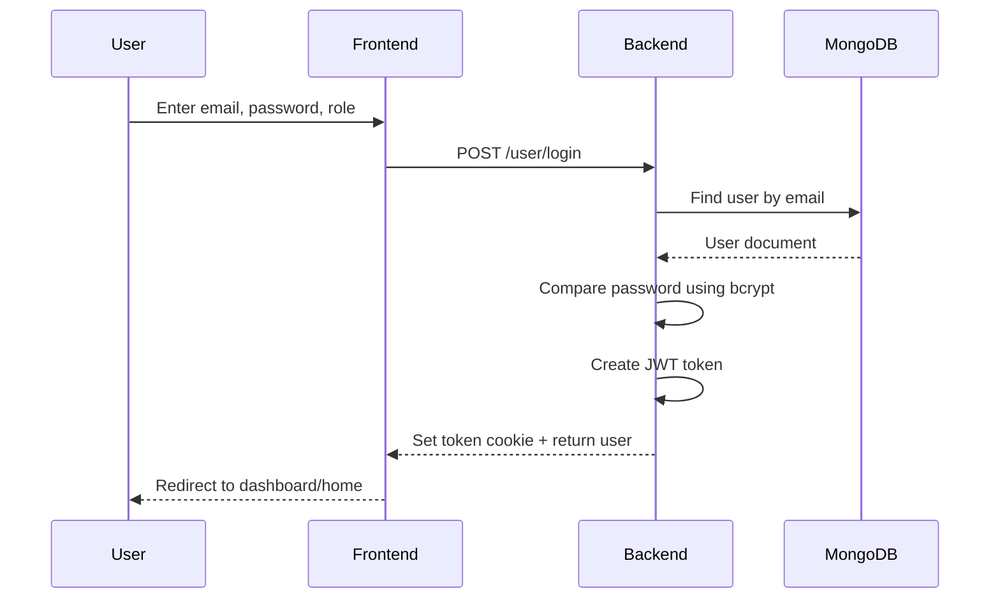

### Files Involved

| Step | File |
| --- | --- |
| Login form | `frontend/src/components/Auth/Login.jsx` |
| Axios setup | `frontend/src/utils/api.js` |
| User route | `backend/routes/userRoutes.js` |
| Login logic | `backend/controllers/userController.js` |
| JWT cookie | `backend/utils/jwtToken.js` |
| Auth middleware | `backend/middlewares/auth.js` |
| User model | `backend/models/userSchema.js` |

### Interview Answer

> When a user logs in, the frontend sends email, password, and role to the backend. The backend finds the user in MongoDB, compares the password using bcrypt, creates a JWT token, and stores it in an HTTP-only cookie. Protected routes verify this cookie before giving access.

---

## 8. Role-Based Access

There are two roles:

```text
Job Seeker
Employer
```

### Job Seeker Can

- Search jobs
- Upload resume
- Apply to jobs
- Track application status
- Use AI placement tools

### Employer Can

- Post jobs
- See own posted jobs
- View applications
- Open resume link
- Update application status
- Use AI candidate summary

### Role Logic Visual

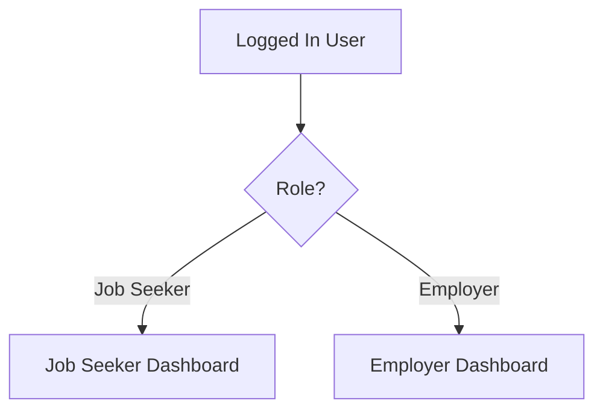

Interview answer:

> The project uses role-based access. The backend checks `req.user.role` before allowing job posting, resume upload, application submission, or employer dashboard access.

---

## 9. Database Models

### Database Visual

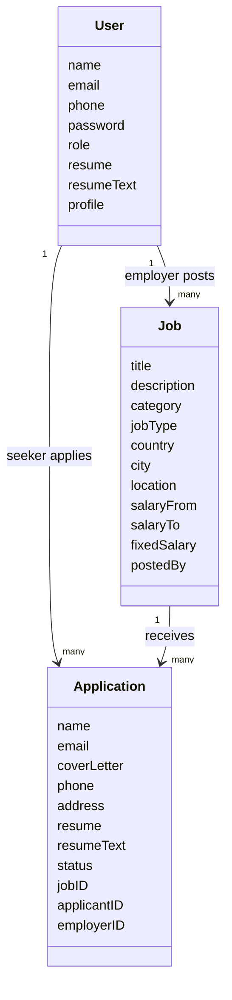

### User Model

File:

```text
backend/models/userSchema.js
```

Stores:

- user identity
- login details
- role
- profile
- resume link
- extracted resume text

### Job Model

File:

```text
backend/models/jobSchema.js
```

Stores:

- job details
- job type
- salary
- city/country
- employer who posted the job

### Application Model

File:

```text
backend/models/applicationSchema.js
```

Stores:

- applicant details
- selected job
- employer
- resume
- current status

---

## 10. Job Search And Filter

### Feature

Job seekers can filter jobs by:

- search keyword
- job type
- location
- salary range

### Files

| Part | File |
| --- | --- |
| Frontend jobs page | `frontend/src/components/Job/Jobs.jsx` |
| Backend route | `backend/routes/jobRoutes.js` |
| Backend logic | `backend/controllers/jobController.js` |
| Job model | `backend/models/jobSchema.js` |

### Flow

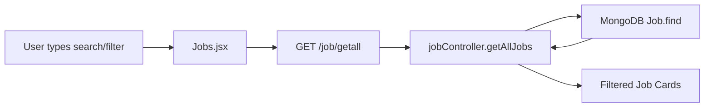

### Interview Answer

> Job filtering is implemented by sending query parameters from the frontend to the backend. The backend builds a MongoDB query based on search text, job type, location, and salary range, then returns matching jobs.

Example:

```text
GET /api/v1/job/getall?search=mern&jobType=Internship&location=Pune, India&salaryRange=0-30000
```

---

## 11. Resume Upload

### What Happens

1. Job seeker selects a PDF.
2. Frontend sends it as `FormData`.
3. Backend validates PDF type and size.
4. Backend extracts text from PDF.
5. Backend uploads PDF to Cloudinary.
6. Backend saves Cloudinary URL and extracted text in MongoDB.

### Resume Upload Visual

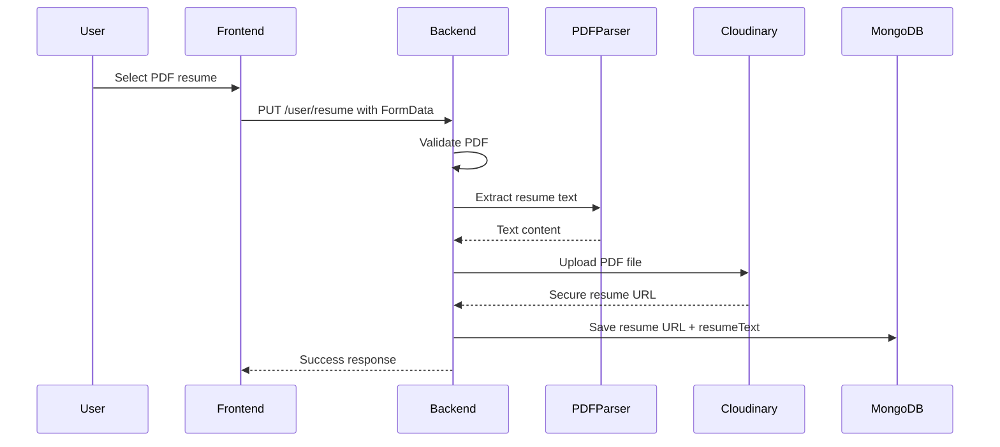

### Files

| Part | File |
| --- | --- |
| Dashboard upload UI | `frontend/src/components/Application/MyApplications.jsx` |
| User route | `backend/routes/userRoutes.js` |
| Upload controller | `backend/controllers/userController.js` |
| Resume service | `backend/services/resumeService.js` |
| User model | `backend/models/userSchema.js` |

### Key Concepts

`FormData` is used for file upload.

`express-fileupload` receives the file in backend.

`pdf-parse` extracts text from the PDF.

Cloudinary stores the actual PDF file.

MongoDB stores:

```text
resume.url
resume.public_id
resumeText
```

### Important Limitation

Text extraction works for normal text-based PDFs.

If the PDF is image-only or scanned, it needs OCR. This project does not use OCR.

Interview answer:

> Resume upload uses express-fileupload to receive a PDF, pdf-parse to extract text, Cloudinary to store the file, and MongoDB to store the resume URL and extracted text for AI analysis.

---

## 12. Applying To A Job

### Flow

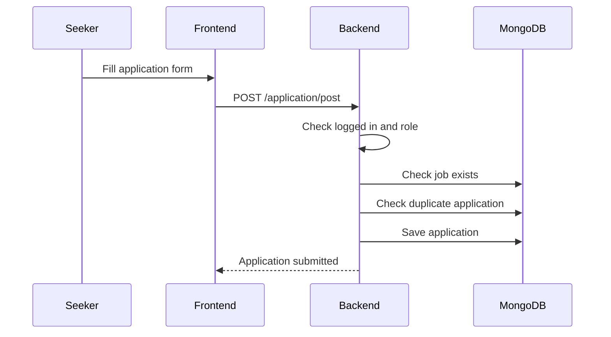

### Files

| Part | File |
| --- | --- |
| Application form | `frontend/src/components/Application/Application.jsx` |
| Application route | `backend/routes/applicationRoutes.js` |
| Controller | `backend/controllers/applicationController.js` |
| Application model | `backend/models/applicationSchema.js` |

### Interview Answer

> When a job seeker applies, the backend checks authentication, validates fields, checks that the job exists, prevents duplicate applications, and saves the application with applicant ID, employer ID, job ID, resume link, and status.

---

## 13. Application Status Tracking

Application statuses:

```text
Pending
Shortlisted
Rejected
```

### Status Visual

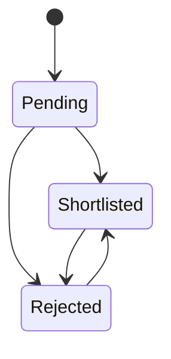

### Flow

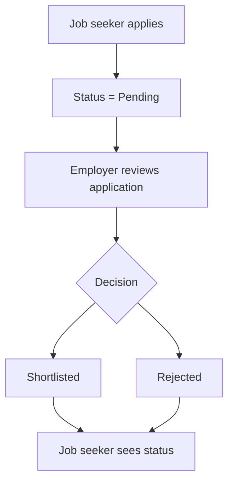

### Interview Answer

> Every application has a status field. By default it is Pending. Employers can update it to Shortlisted or Rejected, and the job seeker dashboard reads these applications to show current status counts.

---

## 14. Dashboards

### Job Seeker Dashboard

Shows:

- total applications
- pending applications
- shortlisted applications
- rejected applications
- list of applied jobs
- resume upload
- resume analysis

Main frontend file:

```text
frontend/src/components/Application/MyApplications.jsx
```

Backend route:

```text
GET /api/v1/application/jobseeker/dashboard
```

### Employer Dashboard

Shows:

- total jobs posted
- total applications received
- posted jobs
- application count per job
- employer applications
- candidate resume links

Backend route:

```text
GET /api/v1/job/employer/dashboard
```

### Dashboard Visual

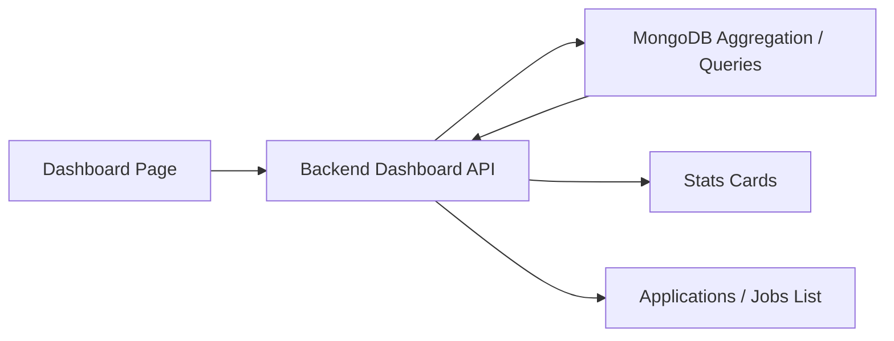

---

## 15. AI Features

The project uses Gemini API free tier.

If Gemini is missing or fails, the app uses built-in smart fallback logic.

### AI Features List

| Feature | User |
| --- | --- |
| Career advice | Job seeker |
| Resume analysis | Job seeker |
| Job match | Job seeker |
| Cover letter | Job seeker |
| Interview questions | Job seeker |
| Skill roadmap | Job seeker |
| Candidate summary | Employer |
| Job description draft | Employer |

### AI Visual

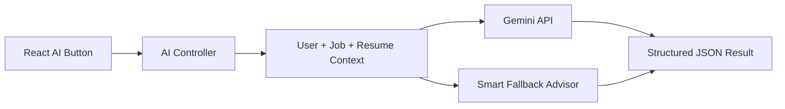

### What Is Context?

AI needs useful input. The backend creates context using:

- user profile
- resume text
- job title
- job description
- job skills/category
- application cover letter

Example:

```text
Candidate skills: React, Node.js, MongoDB
Target role: MERN Intern
Job description: Build React dashboards and APIs
```

### Why Structured JSON?

AI responses should be predictable.

Instead of random text, backend asks Gemini to return fields like:

```text
summary
matchScore
strengths
gaps
nextSteps
```

This makes it easier for React to display the result in cards/lists.

### Interview Answer

> I integrated Gemini API for placement-focused AI tools. The backend builds structured context from user profile, resume text, and job data, sends it to Gemini, validates the JSON response, and returns it to the frontend. If Gemini is unavailable, the app uses built-in smart fallback logic.

---

## 16. External Jobs API

The app has internal jobs and external jobs.

### Internal Jobs

Posted by employers using this app.

Stored in MongoDB.

### External Jobs

Fetched from Adzuna API.

Not stored in MongoDB.

### Visual

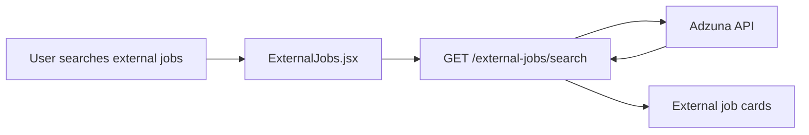

Interview answer:

> External jobs are fetched from Adzuna using backend API credentials. The backend normalizes Adzuna results and sends them to the frontend. These jobs are not saved in MongoDB.

---

## 17. Deployment

### Deployment Visual

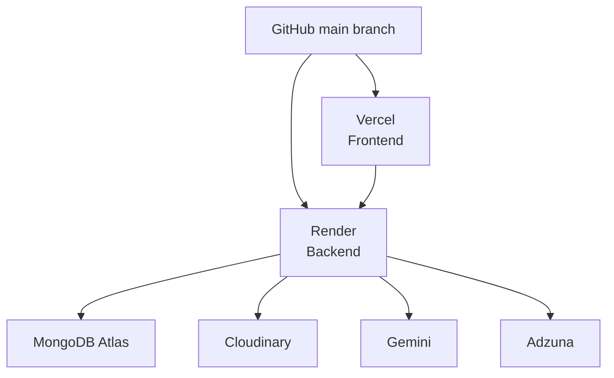

### Frontend Deployment

Platform:

```text
Vercel
```

Root directory:

```text
frontend
```

Important environment variable:

```text
VITE_API_URL=https://job-portal-ftw4.onrender.com/api/v1
```

### Backend Deployment

Platform:

```text
Render
```

Root directory:

```text
backend
```

Important environment variables:

```text
DB_URL
JWT_SECRET_KEY
FRONTEND_URL
COOKIE_SAME_SITE
COOKIE_SECURE
CLOUDINARY_CLOUD_NAME
CLOUDINARY_API_KEY
CLOUDINARY_API_SECRET
GEMINI_API_KEY
ADZUNA_APP_ID
ADZUNA_APP_KEY
```

### Interview Answer

> I deployed the React frontend on Vercel and the Express backend on Render. MongoDB Atlas is used for database, Cloudinary for resume storage, Gemini for AI, and environment variables are configured separately on deployment platforms.

---

## 18. Important APIs To Know

### User APIs

| Method | Endpoint | Use |
| --- | --- | --- |
| POST | `/user/register` | Create user |
| POST | `/user/login` | Login |
| GET | `/user/logout` | Logout |
| GET | `/user/getuser` | Get current user |
| PUT | `/user/profile` | Update profile |
| PUT | `/user/resume` | Upload resume |

### Job APIs

| Method | Endpoint | Use |
| --- | --- | --- |
| GET | `/job/getall` | Get/search/filter jobs |
| POST | `/job/post` | Employer posts job |
| GET | `/job/getmyjobs` | Employer gets own jobs |
| GET | `/job/employer/dashboard` | Employer dashboard |
| GET | `/job/:id` | Single job |
| PUT | `/job/update/:id` | Update job |
| DELETE | `/job/delete/:id` | Delete job |

### Application APIs

| Method | Endpoint | Use |
| --- | --- | --- |
| POST | `/application/post` | Apply to job |
| GET | `/application/employer/getall` | Employer applications |
| PUT | `/application/employer/status/:id` | Update status |
| GET | `/application/jobseeker/dashboard` | Job seeker dashboard |
| GET | `/application/jobseeker/getall` | Job seeker applications |
| DELETE | `/application/delete/:id` | Delete own application |

### AI APIs

| Method | Endpoint | Use |
| --- | --- | --- |
| POST | `/ai/career-advice` | Career advice |
| POST | `/ai/resume-analysis` | Analyze resume |
| GET | `/ai/job-match/:id` | Job match |
| POST | `/ai/cover-letter/:id` | Cover letter |
| GET | `/ai/interview-questions/:id` | Interview questions |
| GET | `/ai/skill-roadmap/:id` | Skill roadmap |
| GET | `/ai/application-summary/:id` | Employer candidate summary |
| POST | `/ai/job-description` | AI job description |

---

## 19. How To Explain The Project In Interview

Use this answer:

> My project is a MERN stack job portal. It has two roles: job seeker and employer. Job seekers can search and save jobs, upload resumes, apply for jobs, track application status, view interview schedules, receive notifications, and use AI tools for resume analysis, job match, cover letters, interview questions, and skill roadmaps. Employers can post jobs, view applications, open Cloudinary-hosted resumes, update application status, schedule interviews, view analytics, and generate AI candidate summaries. The frontend is built with React and Tailwind CSS. The backend is built with Express and MongoDB using Mongoose. Authentication uses short-lived JWT access tokens and rotating refresh tokens stored in HTTP-only cookies. Resume PDFs are uploaded to Cloudinary and text is extracted using pdf-parse. AI uses Gemini API free tier with fallback logic. The frontend is deployed on Vercel and backend on Render.

Short version:

> It is a role-based MERN job portal with job posting, saved jobs, applications, resume upload, dashboards, status tracking, interview scheduling, real-time notifications, Gemini AI placement tools, and deployment on Vercel/Render.

---

## 20. Resume Points

Use these bullets:

```text
JobPortal - MERN Stack Job Portal Application
- Developed a role-based job portal using React, Node.js, Express.js, MongoDB, and Tailwind CSS.
- Implemented JWT authentication with HTTP-only cookies and protected routes for job seekers and employers.
- Built job search and filtering by keyword, job type, location, and salary range.
- Built saved jobs/bookmark workflow with a dedicated saved jobs dashboard.
- Added PDF resume upload using Cloudinary and resume text extraction using pdf-parse.
- Created job seeker and employer dashboards with application status tracking, interview scheduling, and analytics.
- Added Socket.IO notifications for application, resume, status, and interview events.
- Integrated Gemini API for resume analysis, job matching, cover letter generation, interview questions, and skill roadmaps.
- Added secure password reset with hashed reset tokens and refresh-token rotation.
- Added Jest/Supertest API tests and GitHub Actions CI with MongoDB service and Docker builds.
- Integrated Adzuna API to fetch live external job listings.
- Deployed frontend on Vercel and backend on Render with MongoDB Atlas.
```

If you want a shorter resume version:

```text
Built a MERN stack job portal with role-based authentication, job posting, saved jobs, applications, resume upload, dashboards, interview scheduling, real-time notifications, Gemini AI placement tools, Adzuna live jobs, CI/CD, and deployment on Vercel/Render.
```

---

## 21. Interview Questions And Answers

### Q1. What is the purpose of this project?

Answer:

> The purpose is to connect job seekers and employers. Job seekers can apply for jobs and track status. Employers can post jobs and manage applications. The project also includes AI placement tools using Gemini.

### Q2. Why did you use MongoDB?

Answer:

> MongoDB is flexible for storing users, jobs, applications, profiles, resume links, and changing data structures. Mongoose helps define schemas and relationships.

### Q3. How does authentication work?

Answer:

> Authentication uses JWT. After login, the backend verifies email/password, creates a token, and stores it in an HTTP-only cookie. Protected routes use middleware to verify the token.

### Q4. Why use bcrypt?

Answer:

> bcrypt hashes passwords before storing them, so real passwords are never saved in MongoDB.

### Q5. What are protected routes?

Answer:

> Protected routes require a logged-in user. The backend verifies JWT, and the frontend redirects unauthenticated users to login.

### Q6. How does resume upload work?

Answer:

> The frontend sends the PDF as FormData. The backend validates it, extracts text using pdf-parse, uploads the PDF to Cloudinary, and stores the Cloudinary URL plus extracted text in MongoDB.

### Q7. Why use Cloudinary?

Answer:

> Cloudinary provides cloud storage for uploaded resume PDFs. This avoids storing files directly on the server, which is important because Render free services do not provide reliable persistent file storage.

### Q8. How does job filtering work?

Answer:

> The frontend sends filter values as query parameters. The backend builds a MongoDB query using search regex, job type, location, and salary range, then returns matching jobs.

### Q9. How does application status tracking work?

Answer:

> Each application has a status field. It starts as Pending. Employers can update it to Shortlisted or Rejected. The job seeker dashboard reads application counts by status.

### Q10. How does AI work?

Answer:

> The backend prepares structured context from profile, resume text, job data, or application data. It sends that to Gemini and asks for JSON output. If Gemini fails, built-in fallback logic returns useful results.

### Q11. What is fallback logic?

Answer:

> Fallback logic is local code that generates simple advice or analysis when the AI provider is unavailable. It keeps the app usable even if the API key is missing or the provider fails.

### Q12. What is CORS?

Answer:

> CORS controls which frontend domain can call the backend. Since Vercel and Render use different domains, the backend must allow the Vercel frontend URL.

### Q13. What was one challenge?

Answer:

> One challenge was reliable resume PDF text extraction. The parser had to work with normal text PDFs, and the backend also needed fallback behavior if text extraction failed.

### Q14. What would you improve?

Answer:

> I would add admin moderation, better search ranking through MongoDB Atlas Search or Elasticsearch, OCR for scanned resumes, employer notes, seeded demo data, and frontend component tests.

---

## 22. Concepts To Learn In Order

Do not try to learn everything randomly. Learn in this order:

1. HTML, CSS, JavaScript basics
2. React components, state, props
3. React Router
4. Axios API calls
5. Node.js and Express
6. REST API methods: GET, POST, PUT, DELETE
7. MongoDB and Mongoose schemas
8. JWT authentication
9. Cookies and protected routes
10. File upload with FormData
11. Cloudinary
12. API integration: Gemini and Adzuna
13. Real-time notifications with Socket.IO
14. Background jobs and email with BullMQ, Redis, and Nodemailer
15. Testing with Jest, Supertest, ESLint, and GitHub Actions
16. Deployment: Vercel, Render, MongoDB Atlas

---

## 23. Seven-Day Placement Preparation Plan

### Day 1: Understand The App

Goal:

- Know what the project does.
- Understand user roles.
- Run frontend and backend.

Practice:

- Explain project in 2 minutes.
- Draw architecture from memory.

### Day 2: Frontend

Study:

- `App.jsx`
- `Login.jsx`
- `Register.jsx`
- `Jobs.jsx`
- `MyApplications.jsx`

Practice:

- Explain React component.
- Explain how form submission works.
- Explain Axios call.

### Day 3: Backend Routes And Controllers

Study:

- `userRoutes.js`
- `jobRoutes.js`
- `applicationRoutes.js`
- `userController.js`
- `jobController.js`
- `applicationController.js`

Practice:

- Explain route to controller flow.
- Explain one full API from request to response.

### Day 4: Database

Study:

- `userSchema.js`
- `jobSchema.js`
- `applicationSchema.js`

Practice:

- Draw model relationships.
- Explain why `postedBy`, `jobID`, `applicantID`, and `employerID` exist.

### Day 5: Authentication

Study:

- `jwtToken.js`
- `auth.js`
- login/register controller

Practice:

- Explain JWT.
- Explain HTTP-only cookie.
- Explain role-based access.

### Day 6: Resume Upload And AI

Study:

- `resumeService.js`
- `aiController.js`

Practice:

- Explain PDF upload flow.
- Explain Gemini AI flow.
- Explain fallback logic.

### Day 7: Deployment And Mock Interview

Study:

- Vercel settings
- Render settings
- environment variables

Practice:

- Demo project.
- Answer 15 interview questions.
- Explain one bug and how it was fixed.

---

## 24. Demo Script For Interview

Follow this order:

1. Open homepage.
2. Register/login as employer.
3. Post a job.
4. Show employer dashboard.
5. Register/login as job seeker.
6. Search/filter jobs.
7. Upload resume.
8. Run resume analysis.
9. Apply to job.
10. Login as employer.
11. View application and resume.
12. Update status to Shortlisted.
13. Login as job seeker.
14. Show dashboard status changed.
15. Show AI career advice or job match.

What to say during demo:

> This shows the full flow from job posting to application tracking, including resume upload, role-based access, and AI placement support.

---

## 25. One Complete Example: Login API

### Frontend

User enters email/password in:

```text
frontend/src/components/Auth/Login.jsx
```

Frontend sends:

```text
POST /api/v1/user/login
```

### Backend Route

```text
backend/routes/userRoutes.js
```

The route calls:

```text
login controller
```

### Backend Controller

```text
backend/controllers/userController.js
```

The controller:

1. validates email/password/role
2. finds user in MongoDB
3. compares password using bcrypt
4. checks role
5. creates JWT
6. sends cookie

### Response

Frontend receives:

```text
success: true
user: {...}
message: User logged in successfully.
```

Then frontend updates app state and redirects user.

---

## 26. One Complete Example: Resume Upload API

### Frontend

File:

```text
frontend/src/components/Application/MyApplications.jsx
```

Sends:

```text
PUT /api/v1/user/resume
```

with `FormData`.

### Backend

Route:

```text
backend/routes/userRoutes.js
```

Controller:

```text
backend/controllers/userController.js
```

Service:

```text
backend/services/resumeService.js
```

### Backend Steps

1. Check user is job seeker.
2. Check PDF exists.
3. Validate file type and size.
4. Extract PDF text.
5. Upload PDF to Cloudinary.
6. Save URL and text in MongoDB.

### Interview Answer

> Resume upload is separated into controller and service logic. The controller handles request/response and user authorization. The service handles validation, text extraction, Cloudinary upload, and cleanup.

---

## 27. What You Should Not Say

Do not say:

> I built the whole thing from scratch without help.

Do not say:

> I know every line perfectly.

Better answer:

> I developed and customized this MERN job portal, integrated important features, debugged deployment/API issues, and studied the architecture so I can explain the flow clearly.

This is honest and still strong.

---

## 28. Strong Final Interview Pitch

Memorize this:

> JobPortal is a full-stack MERN application built for placement workflows. It supports two roles: job seeker and employer. Job seekers can search and filter jobs, upload a PDF resume, apply for jobs, track status, and use Gemini AI tools for resume analysis, job matching, cover letters, interview questions, and skill roadmaps. Employers can post jobs, view candidate applications and resumes, update statuses, and generate AI candidate summaries. The backend uses Express, MongoDB, JWT authentication, Cloudinary file storage, and Gemini API. The frontend uses React, Tailwind CSS, React Router, Axios, and toast notifications. It is deployed using Vercel for frontend and Render for backend.

---

## 29. Quick Revision Sheet

```text
Frontend = React UI
Backend = Express API
Database = MongoDB
Model = Data structure
Route = API URL
Controller = Logic
Middleware = Runs before controller
JWT = Login proof
Cookie = Stores JWT
bcrypt = Password hashing
CORS = Allows frontend to call backend
Cloudinary = Stores PDF resumes
pdf-parse = Extracts text from PDF
Gemini = Free AI provider
Adzuna = External jobs API
Vercel = Frontend deployment
Render = Backend deployment
```

---

## 30. Practice Task

To prove you understand this project, explain these without looking:

1. What happens when a user logs in?
2. What happens when a job seeker uploads a resume?
3. What happens when a job seeker applies to a job?
4. How does employer update status?
5. How does job search filter work?
6. How does Gemini AI get context?
7. What is stored in MongoDB?
8. What is stored in Cloudinary?
9. Why do we need CORS?
10. How is the app deployed?

If you can answer these 10 questions, you can discuss this project in placement interviews.

---

## 31. Beginner Terminology Dictionary

This section explains common technical words in simple language.

### Software Project

| Term | Simple Meaning | In This Project |
| --- | --- | --- |
| Project | A complete software application | JobPortal |
| Codebase | All source code files together | `frontend`, `backend`, `docs` |
| Repository / Repo | Project stored in GitHub | `Job-portal` repo |
| Branch | A version line of code | `main` branch |
| Commit | Saved snapshot of changes | A pushed change in Git |
| Push | Upload commits to GitHub | `git push origin main` |
| Pull | Download latest code from GitHub | `git pull` |
| Merge | Combine changes | Usually used in team work |
| Dependency | External package used by project | React, Express, Mongoose |
| Package | Reusable code library | `axios`, `bcrypt`, `pdf-parse` |
| Build | Convert code into production files | Vite builds frontend |
| Deploy | Put app online | Vercel and Render |
| Environment | Where app runs | local, development, production |

### Web Application

| Term | Simple Meaning | Example |
| --- | --- | --- |
| Client | User side/browser side | React frontend |
| Server | Backend computer/program | Express API |
| Frontend | UI user sees | Login page, jobs page |
| Backend | Hidden server logic | Auth, database, upload |
| Database | Stores data permanently | MongoDB |
| API | A way for frontend to talk to backend | `/api/v1/job/getall` |
| Endpoint | One API URL | `/user/login` |
| Request | Message sent to backend | Login form data |
| Response | Message returned by backend | Success/error JSON |
| JSON | Data format used by APIs | `{ "success": true }` |
| URL | Web address | `https://job-portal...` |
| Domain | Website name/address | Vercel or Render URL |
| Hosting | Running app online | Vercel, Render |

### HTTP Terms

| Term | Meaning | Example |
| --- | --- | --- |
| HTTP | Protocol used by websites | Browser to server communication |
| Method | Type of API action | GET, POST, PUT, DELETE |
| GET | Fetch data | Get all jobs |
| POST | Create/send data | Register user |
| PUT | Update data | Update profile |
| DELETE | Remove data | Delete application |
| Status Code | Number showing result | 200, 400, 401, 500 |
| Header | Extra request/response info | Cookie, Content-Type |
| Body | Main data sent in request | Login email/password |
| Query Parameter | Filter values in URL | `?search=mern` |
| Route Parameter | Dynamic value in URL | `/job/:id` |

### Status Codes

| Code | Meaning | Example |
| --- | --- | --- |
| 200 | OK | Login success |
| 201 | Created | User registered |
| 400 | Bad request | Missing required field |
| 401 | Unauthorized | Not logged in |
| 403 | Forbidden | Wrong role |
| 404 | Not found | Job not found |
| 500 | Server error | Backend bug or service failure |

### React Terms

| Term | Simple Meaning | In This Project |
| --- | --- | --- |
| Component | Reusable UI block | Navbar, Login, Jobs |
| Page Component | Component used as page | Home, Profile, MyApplications |
| Props | Data passed to component | `status` passed to `StatusBadge` |
| State | Data that changes in UI | form inputs, loading |
| Hook | React helper function | `useState`, `useEffect`, `useContext` |
| useState | Stores changing data | search text, user form |
| useEffect | Runs code on load/change | fetch jobs after filter changes |
| Context | Shared data across app | logged-in user |
| React Router | Handles frontend pages | `/login`, `/job/getall` |
| Protected Route | Page blocked until login | Profile, dashboards |
| Controlled Input | Input controlled by state | Login email field |
| Conditional Rendering | Show UI based on condition | show spinner when loading |
| Toast | Small success/error message | `react-hot-toast` |

### Backend Terms

| Term | Simple Meaning | In This Project |
| --- | --- | --- |
| Node.js | Runs JavaScript outside browser | Backend runtime |
| Express.js | Framework for backend APIs | Routes and middleware |
| Route | API path definition | `router.post("/login", login)` |
| Controller | Function containing logic | `login`, `postJob` |
| Middleware | Function before controller | auth check, error handler |
| Service | Reusable helper logic | resume upload service |
| Validation | Checking data is correct | email, phone, password |
| Error Handling | Returning clean errors | error middleware |
| Async/Await | Wait for slow operations | database/API calls |
| Promise | Future result of async work | MongoDB query |
| CORS | Allows frontend domain to call backend | Vercel -> Render |

### Database Terms

| Term | Simple Meaning | In This Project |
| --- | --- | --- |
| MongoDB | NoSQL database | Stores app data |
| Collection | Group of documents | users, jobs, applications |
| Document | One data record | one user, one job |
| Schema | Structure/rules for document | userSchema |
| Model | JS object for collection | `User`, `Job`, `Application` |
| ObjectId | MongoDB unique ID | job ID, user ID |
| Reference | Link between documents | job `postedBy` user |
| Query | Database search command | `Job.find()` |
| Populate | Replace ID with full data | employer details in application |
| Aggregate | Advanced database calculation | application count per job |

### Security Terms

| Term | Simple Meaning | In This Project |
| --- | --- | --- |
| Authentication | Checking who user is | login |
| Authorization | Checking what user can do | role-based access |
| JWT | Login token | Stored in cookie |
| Cookie | Browser storage sent with requests | token cookie |
| HTTP-only Cookie | Cookie JS cannot read | safer token storage |
| bcrypt | Password hashing library | hides real password |
| Hashing | One-way password conversion | password -> encrypted-looking hash |
| Secret Key | Private key for signing tokens | `JWT_SECRET_KEY` |
| Environment Variable | Secret/config outside code | DB URL, API keys |

### Cloud And API Terms

| Term | Simple Meaning | In This Project |
| --- | --- | --- |
| Cloudinary | Cloud file storage | Stores resume PDFs |
| MongoDB Atlas | Cloud MongoDB | Production database |
| Gemini API | Free AI provider | AI tools |
| Adzuna API | Jobs data provider | External live jobs |
| API Key | Password for an external API | Gemini, Adzuna, Cloudinary |
| Rate Limit | API usage limit | Free APIs have limits |
| Provider | External service | Gemini, Adzuna, Cloudinary |
| Fallback | Backup behavior | smart advisor if Gemini fails |

---

## 32. Technical Concepts Explained From Zero

### What Is Frontend?

Frontend is the visible part of the app.

Examples:

- login form
- register form
- job cards
- dashboard cards
- resume upload button
- AI result cards

In this project frontend is inside:

```text
frontend/
```

The frontend uses React.

Simple explanation:

> Frontend is like the shop counter. User interacts with it.

### What Is Backend?

Backend is the hidden part.

It handles:

- login
- password checking
- database operations
- resume upload
- AI API calls
- external jobs API calls
- application status updates

In this project backend is inside:

```text
backend/
```

Simple explanation:

> Backend is like the office behind the shop. It processes the real work.

### What Is Database?

Database stores data permanently.

If user closes browser, data should not disappear.

MongoDB stores:

- users
- jobs
- applications
- resume URLs
- extracted resume text
- profiles

Simple explanation:

> Database is like the register/book where records are saved.

### Frontend, Backend, Database Visual

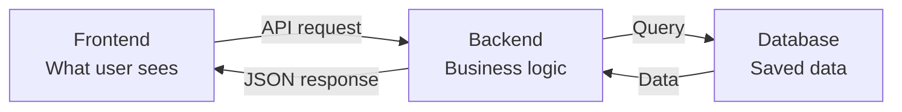

---

## 33. API Concepts With Examples

### What Is An API?

API is a communication rule between frontend and backend.

Example:

Frontend says:

```text
Please login this user.
```

API request:

```text
POST /api/v1/user/login
```

Backend replies:

```json
{
  "success": true,
  "message": "User logged in successfully."
}
```

### API Request Parts

```text
POST https://job-portal-ftw4.onrender.com/api/v1/user/login
```

Breakdown:

| Part | Meaning |
| --- | --- |
| `POST` | HTTP method |
| `https://job-portal-ftw4.onrender.com` | Backend server |
| `/api/v1` | API version prefix |
| `/user/login` | Endpoint |

### Request Body Example

```json
{
  "email": "student@example.com",
  "password": "Password123",
  "role": "Job Seeker"
}
```

### Response Example

```json
{
  "success": true,
  "user": {
    "name": "Saurav",
    "role": "Job Seeker"
  }
}
```

### Query Parameter Example

```text
/job/getall?search=mern&jobType=Internship
```

Means:

- search jobs containing `mern`
- only show `Internship` jobs

### Route Parameter Example

```text
/job/64ab123
```

Here `64ab123` is a job ID.

In backend route it is written as:

```text
/job/:id
```

---

## 34. React Concepts For This Project

### Component

A component is a piece of UI.

Example:

```text
Navbar
Login
Jobs
JobDetails
Profile
```

React builds pages by combining components.

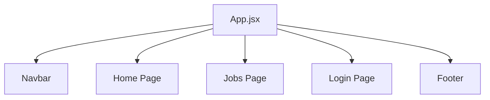

### State

State is data that changes on the screen.

Examples:

- email typed in login input
- selected job type filter
- loading true/false
- fetched jobs list

Example idea:

```text
search = "mern"
loading = true
jobs = [...]
```

### Props

Props are data passed from parent component to child component.

Example:

```text
StatusBadge receives status = "Shortlisted"
```

Then it displays a Shortlisted badge.

### useEffect

`useEffect` runs code after component loads or when some value changes.

Example:

When search filter changes, fetch jobs again.

```text
search changes -> useEffect runs -> API call -> jobs update
```

### Context

Context shares data across many components.

In this project it stores logged-in user data.

Example:

Navbar needs to know if user is logged in.

Profile page needs user data.

Dashboard needs user role.

Instead of passing user everywhere manually, Context shares it.

### Protected Route

Protected route means user cannot open page unless logged in.

Example:

```text
/profile
/application/me
/job/post
```

If not logged in:

```text
redirect to /login
```

---

## 35. Backend Concepts For This Project

### Express App

`app.js` creates the backend app.

It configures:

- CORS
- JSON parsing
- cookies
- file upload
- routes
- error handling

### Server

`server.js` starts listening on a port.

Example:

```text
PORT=4000
```

Means backend runs at:

```text
http://localhost:4000
```

### Route

Route connects an API URL to controller function.

Example:

```text
POST /user/login -> login controller
```

### Controller

Controller contains business logic.

Example login controller:

1. get email/password
2. validate input
3. find user
4. check password
5. create token
6. send response

### Middleware

Middleware runs before controller.

Authentication middleware:

1. read token cookie
2. verify JWT
3. find user
4. attach user to request
5. allow controller to run

Visual:

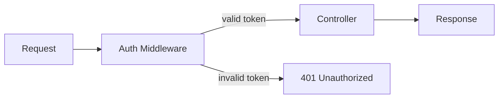

### Service

Service is reusable logic separated from controller.

Example:

`resumeService.js` handles:

- validate PDF
- extract text
- upload to Cloudinary
- delete old resume

Why service is useful:

- controller stays cleaner
- same logic can be reused
- easier to test/debug

---

## 36. MongoDB Concepts For This Project

### SQL vs MongoDB

Traditional SQL:

```text
Table -> Row
```

MongoDB:

```text
Collection -> Document
```

Example:

```text
users collection -> one user document
jobs collection -> one job document
applications collection -> one application document
```

### Document Example

User document:

```json
{
  "name": "Saurav",
  "email": "saurav@example.com",
  "role": "Job Seeker",
  "profile": {
    "skills": "React, Node.js, MongoDB"
  }
}
```

### Schema

Schema defines rules.

Example:

User must have:

- name
- email
- phone
- password
- role

### Relationship

MongoDB does not use joins like SQL, but we can store IDs.

Example:

Job has:

```text
postedBy: employer user ID
```

Application has:

```text
jobID: job ID
applicantID.user: job seeker user ID
employerID.user: employer user ID
```

### Populate

Populate means replacing an ID with actual document data.

Without populate:

```json
{
  "postedBy": "64abc123"
}
```

With populate:

```json
{
  "postedBy": {
    "name": "ABC Company",
    "email": "hr@example.com"
  }
}
```

---

## 37. Authentication Concepts Deep Explanation

### Authentication vs Authorization

Authentication:

```text
Who are you?
```

Example:

Login with email/password.

Authorization:

```text
What are you allowed to do?
```

Example:

Employer can post job.

Job seeker cannot post job.

### JWT Flow

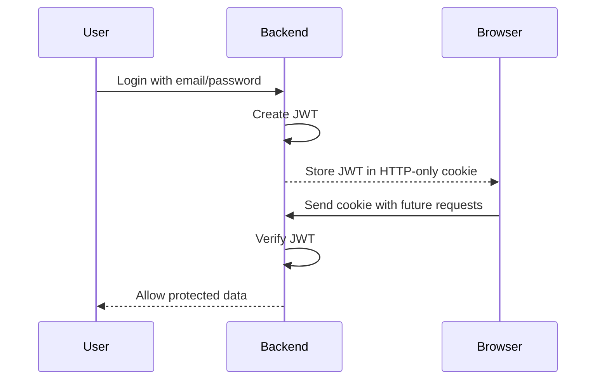

### Why Not Store Password Directly?

If database is hacked, plain passwords are dangerous.

So bcrypt stores password hash.

Example:

```text
Password: Password123
Hash: $2b$10$u98sd...
```

Hash cannot be easily reversed.

During login:

```text
entered password + stored hash -> bcrypt.compare -> true/false
```

---

## 38. File Upload Concepts

### Normal JSON Request

Used for text data:

```json
{
  "name": "Saurav",
  "email": "saurav@example.com"
}
```

### File Upload Request

Files cannot be sent as normal JSON.

So frontend uses:

```text
FormData
```

FormData can send:

- text fields
- files

### Resume Upload Data

Frontend sends:

```text
resume: selected PDF file
```

Backend receives:

```text
req.files.resume
```

### Why Store PDF In Cloudinary?

If PDF is stored on backend server:

- file may disappear after deployment restart
- Render free service does not guarantee persistent disk
- server storage becomes messy

Cloudinary gives stable file URL.

---

## 39. AI Concepts From Zero

### What Is AI API?

AI API is a service where we send text input and receive generated text or JSON output.

In this project:

```text
Backend sends prompt to Gemini
Gemini returns structured result
Frontend displays result
```

### What Is Prompt?

Prompt is the instruction sent to AI.

Example:

```text
Analyze this resume for a MERN developer role.
Return strengths, gaps, score, and next steps.
```

### What Is Context?

Context is the useful information sent with prompt.

Example:

```text
Candidate skills: React, Node.js, MongoDB
Resume text: ...
Job title: MERN Intern
Job description: ...
```

Better context gives better AI output.

### What Is Structured Output?

Instead of asking AI for a paragraph, backend asks for JSON.

Example:

```json
{
  "summary": "Candidate has MERN basics.",
  "score": 72,
  "strengths": ["React", "Node.js"],
  "issues": ["Add project metrics"]
}
```

Why useful:

- frontend can display score in card
- frontend can display lists
- output is predictable

### What Is Fallback?

Fallback is backup logic.

If Gemini fails:

```text
use local smart advisor
```

Why needed:

- free API can have limits
- API key can expire
- network can fail
- app should not break

---

## 40. Deployment Concepts

### Local Development

Runs on your computer.

Frontend:

```text
http://localhost:5173
```

Backend:

```text
http://localhost:4000
```

### Production

Runs online.

Frontend:

```text
Vercel URL
```

Backend:

```text
Render URL
```

### Build

Build means preparing code for production.

Frontend build command:

```text
npm run build
```

This creates:

```text
dist/
```

Vercel serves this built frontend.

### Environment Variables In Deployment

Local `.env` is not automatically sent to Render/Vercel.

You must add env variables in platform dashboard.

Examples:

Render backend:

```text
DB_URL
JWT_SECRET_KEY
CLOUDINARY_API_SECRET
GEMINI_API_KEY
ADZUNA_APP_KEY
```

Vercel frontend:

```text
VITE_API_URL
```

### Why Separate Frontend And Backend URLs?

Frontend and backend are two separate apps.

Frontend is static UI.

Backend is dynamic API.

So they are deployed separately.

---

## 41. Debugging Concepts

### Common Error Types

| Error | Meaning | Example Fix |
| --- | --- | --- |
| 400 | Bad input | Fill all required fields |
| 401 | Not logged in | Login again |
| 403 | Wrong role | Use correct user role |
| 404 | Not found | Check ID or route |
| 500 | Backend error | Check server logs |
| CORS error | Frontend not allowed | Update `FRONTEND_URL` |
| Network error | API not reachable | Check backend URL |
| Build error | Code failed to compile | Check terminal output |

### How To Debug API

Step-by-step:

1. Check frontend error/toast.
2. Check browser console.
3. Check network request URL.
4. Check backend route exists.
5. Check backend logs.
6. Check database data.
7. Check environment variables.

### Debug Visual

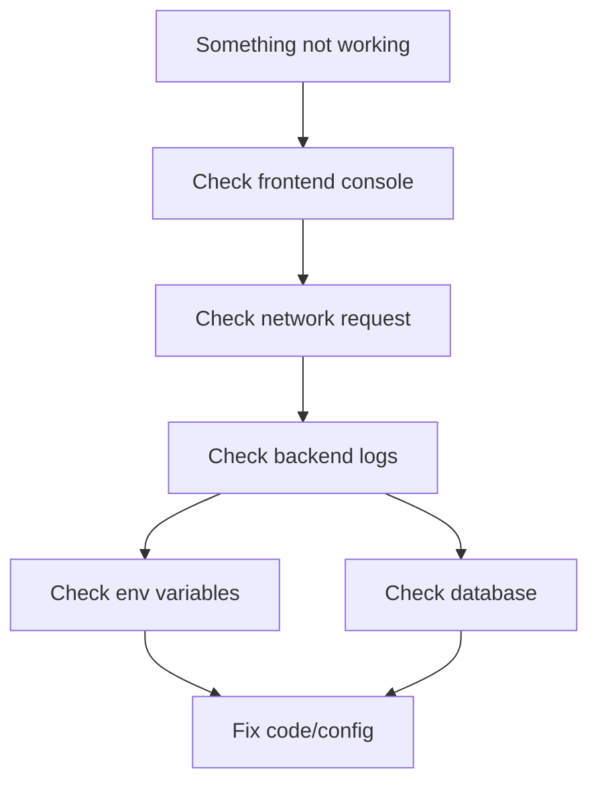

---

## 42. Git And GitHub Concepts

### Git

Git tracks code changes on your computer.

### GitHub

GitHub stores code online.

### Common Commands

```text
git status
```

Shows changed files.

```text
git add file
```

Stages a file for commit.

```text
git commit -m "message"
```

Saves a snapshot.

```text
git push origin main
```

Uploads commits to GitHub.

### Visual

```mermaid
flowchart LR
  Working["Working files"]
  Stage["Staging area"]
  Commit["Local commit"]
  GitHub["GitHub repo"]

  Working -->|"git add"| Stage
  Stage -->|"git commit"| Commit
  Commit -->|"git push"| GitHub
```

### Interview Answer

> I used Git for version control and GitHub to store the repository. Changes were committed with clear messages and pushed to the main branch for deployment.

---

## 43. How To Read This Project's Code

Do not open random files first. Follow this path:

### Step 1: Understand Routes

Open:

```text
backend/app.js
backend/routes/userRoutes.js
backend/routes/jobRoutes.js
backend/routes/applicationRoutes.js
backend/routes/aiRoutes.js
```

Goal:

Know what APIs exist.

### Step 2: Understand Controllers

Open:

```text
backend/controllers/userController.js
backend/controllers/jobController.js
backend/controllers/applicationController.js
backend/controllers/aiController.js
```

Goal:

Know what each API does.

### Step 3: Understand Models

Open:

```text
backend/models/userSchema.js
backend/models/jobSchema.js
backend/models/applicationSchema.js
```

Goal:

Know what data is stored.

### Step 4: Understand Frontend Pages

Open:

```text
frontend/src/App.jsx
frontend/src/components/Auth/Login.jsx
frontend/src/components/Job/Jobs.jsx
frontend/src/components/Application/MyApplications.jsx
```

Goal:

Know what user sees and which APIs are called.

### Step 5: Understand Utilities

Open:

```text
frontend/src/utils/api.js
backend/middlewares/auth.js
backend/services/resumeService.js
backend/utils/jwtToken.js
```

Goal:

Understand API setup, authentication, resume upload, and cookies.

---

## 44. Project Explanation By Feature

### Feature: Register

Frontend:

```text
Register.jsx
```

Backend:

```text
POST /user/register
```

Database:

```text
User collection
```

What happens:

1. User fills form.
2. Backend validates data.
3. Password is hashed.
4. User is saved.
5. JWT cookie is sent.

### Feature: Login

What happens:

1. User enters email/password/role.
2. Backend finds user.
3. bcrypt checks password.
4. Backend checks role.
5. JWT cookie is created.

### Feature: Post Job

Only employer can post.

What happens:

1. Employer fills job form.
2. Backend checks role.
3. Backend validates salary/job type.
4. Job is saved with `postedBy`.

### Feature: Apply Job

Only job seeker can apply.

What happens:

1. Job seeker fills application.
2. Backend checks duplicate application.
3. Backend attaches job ID, seeker ID, employer ID.
4. Status starts as Pending.

### Feature: Update Status

Only employer can update own applications.

What happens:

1. Employer selects status.
2. Backend checks application belongs to employer.
3. Status changes.
4. Job seeker dashboard shows update.

---

## 45. Technical Words Interviewers May Use

### CRUD

CRUD means:

| Letter | Meaning | Example |
| --- | --- | --- |
| C | Create | Register, post job |
| R | Read | Get jobs, get applications |
| U | Update | Update profile, update status |
| D | Delete | Delete job/application |

### REST API

REST API means APIs are organized around resources.

Resources in this project:

- users
- jobs
- applications
- AI tools
- external jobs

### MVC

MVC means Model View Controller.

This project is similar to MVC:

| MVC Part | In This Project |
| --- | --- |
| Model | Mongoose models |
| View | React frontend |
| Controller | Express controllers |

### Monorepo

This project has frontend and backend in one repository.

That is called a monorepo-style structure.

### Full Stack

Full stack means both frontend and backend.

This project is full stack because it includes:

- React frontend
- Express backend
- MongoDB database
- deployment

---

## 46. Concepts You Should Be Able To Draw

Practice drawing these on paper:

### 1. MERN Architecture

```text
React -> Express -> MongoDB
```

### 2. Login Flow

```text
Login form -> Backend -> MongoDB -> JWT cookie -> Protected route
```

### 3. Resume Upload Flow

```text
PDF -> Backend -> pdf-parse -> Cloudinary -> MongoDB
```

### 4. Application Flow

```text
Job seeker -> Apply -> Application saved -> Employer reviews -> Status updated
```

### 5. AI Flow

```text
Profile + Resume + Job -> Backend prompt -> Gemini -> JSON result -> UI
```

---

## 47. Beginner Practice Questions

Answer these in simple English.

1. What is frontend?
2. What is backend?
3. What is database?
4. What is an API?
5. What is a route?
6. What is a controller?
7. What is a model?
8. What is middleware?
9. What is JWT?
10. What is bcrypt?
11. What is CORS?
12. What is Cloudinary?
13. What is Gemini?
14. What is deployment?
15. What is GitHub?

If you cannot answer these, revise sections 31 to 42.

---

## 48. Slightly Advanced Practice Questions

1. Why did we use HTTP-only cookies instead of localStorage?
2. Why does backend validate data even if frontend already validates forms?
3. Why should secrets be in environment variables?
4. Why should scanned PDFs need OCR?
5. Why are frontend and backend deployed separately?
6. Why does CORS happen?
7. Why does employer dashboard need aggregation/application count?
8. Why do we store `resumeText` separately from resume URL?
9. Why do we need fallback if Gemini fails?
10. Why is role-based access important?

---

## 49. Simple Analogies

Use these if concepts feel difficult.

| Concept | Analogy |
| --- | --- |
| Frontend | Restaurant menu/counter |
| Backend | Kitchen |
| Database | Storage room/register |
| API | Waiter carrying order |
| Route | Specific counter window |
| Controller | Chef instruction |
| Model | Form format |
| Middleware | Security guard |
| JWT | Entry pass |
| Cookie | Pass stored in pocket |
| Cloudinary | File locker |
| Gemini | Assistant/consultant |
| Git | Notebook of changes |
| GitHub | Online backup of notebook |
| Deployment | Opening shop to public |

---

## 50. What To Learn Before Saying This Project In Interview

Minimum knowledge:

- What MERN means
- What API means
- Login/JWT flow
- User, Job, Application models
- Resume upload flow
- Job search/filter flow
- Application status flow
- Gemini AI flow
- Vercel/Render deployment

Do not memorize only words. Understand the flow.

Best practice:

Open the app and explain each click:

```text
When I click this button, this React component sends this API request, this backend controller runs, this MongoDB collection is updated, and then the UI changes.
```

That is how you sound confident in interviews.

---

## 51. Mock Interview: Questions And Candidate Answers

This section acts like an interviewer asking you questions. Read the answer as if you are the candidate.

Do not memorize word-for-word only. Understand the meaning.

---

### Interview Round 1: Project Introduction

#### Interviewer: Tell me about your project.

Candidate answer:

> My project is JobPortal, a MERN stack job portal application. It supports two roles: job seeker and employer. Job seekers can register, login, search and filter jobs, save jobs, upload PDF resumes, apply to jobs, track application status, view interview schedules, receive notifications, and use Gemini AI placement tools. Employers can post jobs, view applications, open resumes, update application status, schedule interviews, view analytics, and use AI candidate summaries. The frontend is built with React, Vite, Tailwind CSS, React Router, Axios, Socket.IO Client, Recharts, and react-hot-toast. The backend is built with Node.js, Express.js, MongoDB, Mongoose, JWT authentication, rotating refresh tokens, Cloudinary file upload, Socket.IO, Gemini API, and Adzuna external jobs API.

#### Interviewer: Why did you build this project?

Candidate answer:

> I built this project to understand full-stack development with a real placement-related workflow. It covers authentication, role-based access, CRUD operations, file upload, dashboards, API integration, AI integration, and deployment. These are common features in real web applications.

#### Interviewer: What makes this project different from a basic CRUD app?

Candidate answer:

> It is more than basic CRUD because it has role-based access, rotating refresh-token authentication, saved jobs, resume PDF upload to Cloudinary, PDF text extraction, application status tracking, interview scheduling, real-time notifications, recommendation scoring, analytics dashboards, Gemini AI placement tools, Adzuna external jobs API, protected routes, tests, CI, and production deployment on Vercel and Render.

#### Interviewer: What was your role in this project?

Candidate answer:

> I developed and customized the MERN job portal, added placement-ready features, integrated resume upload, saved jobs, dashboards, application tracking, interview scheduling, notifications, external jobs, Gemini AI tools, deployment configuration, tests, and improved error handling and documentation. I also debugged issues related to API calls, CORS, PDF extraction, cookies, and deployment.

---

### Interview Round 2: Architecture

#### Interviewer: Explain the architecture of your project.

Candidate answer:

> The project has a React frontend and Express backend. The frontend is deployed on Vercel and sends API requests using Axios. The backend is deployed on Render and handles authentication, jobs, saved jobs, applications, interview scheduling, notifications, resume uploads, AI requests, and external jobs. MongoDB Atlas stores users, jobs, saved jobs, applications, refresh tokens, notifications, and recommendation scores. Cloudinary stores resume PDFs. Gemini API provides AI responses, Adzuna API provides external job listings, and Socket.IO powers real-time notifications.

#### Interviewer: Can you draw the architecture?

Candidate answer:

```text
User Browser
   |
React Frontend on Vercel
   |
Express Backend on Render
   |
MongoDB Atlas + Cloudinary + Gemini + Adzuna
   |
Socket.IO notifications + optional Redis/SMTP
```

#### Interviewer: Why did you separate frontend and backend?

Candidate answer:

> React frontend and Express backend have different responsibilities. The frontend handles UI, routing, and user interactions. The backend handles business logic, authentication, database operations, file uploads, and external API calls. Separating them makes deployment and maintenance cleaner.

#### Interviewer: How does frontend communicate with backend?

Candidate answer:

> The frontend uses Axios to send HTTP requests to backend API endpoints. For example, login uses `POST /api/v1/user/login`, jobs use `GET /api/v1/job/getall`, and resume upload uses `PUT /api/v1/user/resume`.

---

### Interview Round 3: MERN Stack

#### Interviewer: What is MERN stack?

Candidate answer:

> MERN stands for MongoDB, Express.js, React.js, and Node.js. MongoDB stores data, Express creates backend APIs, React builds the frontend UI, and Node.js runs the backend JavaScript server.

#### Interviewer: Why did you use React?

Candidate answer:

> React is useful for building component-based user interfaces. In this project, pages like Login, Jobs, Profile, Job Details, and Dashboard are built as reusable components. React state helps manage forms, loading states, filters, and API data.

#### Interviewer: Why did you use Express?

Candidate answer:

> Express makes it easy to create backend REST APIs. I used it for user routes, job routes, application routes, AI routes, and external job routes. It also supports middleware for authentication, error handling, cookies, CORS, and file upload.

#### Interviewer: Why did you use MongoDB?

Candidate answer:

> MongoDB is flexible for storing user profiles, jobs, applications, resume data, and nested objects. Mongoose helps define schemas and validations for the data.

#### Interviewer: What is Mongoose?

Candidate answer:

> Mongoose is an ODM, Object Data Modeling library, for MongoDB. It lets us define schemas and models like User, Job, and Application, and provides methods like `find`, `create`, `findByIdAndUpdate`, and `populate`.

---

### Interview Round 4: Authentication

#### Interviewer: Explain your login flow.

Candidate answer:

> The user enters email, password, and role. The frontend sends a POST request to `/api/v1/user/login`. The backend validates the input, finds the user by email, compares the password using bcrypt, checks the role, creates a JWT token, stores it in an HTTP-only cookie, and returns user data to the frontend.

#### Interviewer: Why did you use JWT?

Candidate answer:

> JWT is used to identify logged-in users. Once the user logs in, the backend signs a token. For protected routes, the backend verifies that token and gets the user details.

#### Interviewer: Where is the JWT stored?

Candidate answer:

> The JWT is stored in an HTTP-only cookie. This is safer than localStorage because browser JavaScript cannot directly read HTTP-only cookies.

#### Interviewer: Why did you add refresh-token rotation?

Candidate answer:

> Access tokens are short-lived, so they reduce risk if stolen. Refresh tokens keep the session alive but are stored as hashes in MongoDB and rotated on refresh. When a refresh token is reused after rotation, the backend can revoke active sessions for that user.

#### Interviewer: How does password reset work?

Candidate answer:

> The user submits an email. The backend creates a random reset token, stores only its SHA-256 hash with a short expiry, and sends the raw token through an email link. When the user submits a new password, the backend hashes the URL token and checks it against MongoDB before updating the password.

#### Interviewer: What is bcrypt used for?

Candidate answer:

> bcrypt is used to hash passwords before saving them in MongoDB. During login, bcrypt compares the entered password with the stored hash.

#### Interviewer: What is the difference between authentication and authorization?

Candidate answer:

> Authentication checks who the user is, usually through login. Authorization checks what the user is allowed to do. For example, only employers are authorized to post jobs, and only job seekers are authorized to apply.

#### Interviewer: How do protected routes work?

Candidate answer:

> On the backend, protected routes use `isAuthenticated` middleware. It reads the token cookie, verifies JWT, finds the user, and attaches user data to `req.user`. On the frontend, protected route components redirect users to login if they are not authenticated.

---

### Interview Round 5: Role-Based Access

#### Interviewer: What roles are available in your project?

Candidate answer:

> There are two roles: Job Seeker and Employer.

#### Interviewer: What can a job seeker do?

Candidate answer:

> A job seeker can search jobs, filter jobs, save jobs, view job details, upload a resume, apply for jobs, track application status, view interview schedules, receive notifications, and use AI placement tools like resume analysis, job match, cover letter, interview questions, and skill roadmap.

#### Interviewer: What can an employer do?

Candidate answer:

> An employer can post jobs, manage their jobs, view applications, open applicant resumes, update application status, schedule or cancel interviews, view employer dashboard charts, rank candidates, summarize candidates using AI, and generate job descriptions.

#### Interviewer: How do you prevent job seekers from posting jobs?

Candidate answer:

> The backend checks `req.user.role`. In the job posting controller, if the role is Job Seeker, it returns a forbidden error. So even if someone tries to call the API manually, the backend blocks it.

---

### Interview Round 6: Database And Models

#### Interviewer: What collections are used in MongoDB?

Candidate answer:

> The main collections are Users, Jobs, Applications, SavedJobs, RefreshTokens, Notifications, and RecommendationScores.

#### Interviewer: Explain the User model.

Candidate answer:

> The User model stores name, email, phone, password, role, profile data, resume file information, extracted resume text, and password reset token metadata. It also has password hashing middleware and methods for password comparison and JWT generation.

#### Interviewer: Explain the Job model.

Candidate answer:

> The Job model stores title, description, category, job type, country, city, location, salary details, expiry status, posting date, and the employer who posted it using `postedBy`.

#### Interviewer: Explain the Application model.

Candidate answer:

> The Application model stores applicant details, cover letter, phone, address, resume link, extracted resume text, application status, interview details, job ID, applicant ID, employer ID, and applied date.

#### Interviewer: How are jobs connected to employers?

Candidate answer:

> Each job has a `postedBy` field that stores the employer user ID. This connects the job to the employer who posted it.

#### Interviewer: How are applications connected to jobs and users?

Candidate answer:

> Each application stores `jobID`, `applicantID.user`, and `employerID.user`. This connects the application to the job, job seeker, and employer.

#### Interviewer: What is populate in Mongoose?

Candidate answer:

> Populate replaces an ObjectId reference with actual document data. For example, when fetching applications, we can populate job details or employer details instead of only getting IDs.

---

### Interview Round 7: Job Search And Filter

#### Interviewer: How does job search work?

Candidate answer:

> The frontend sends search and filter values as query parameters to `/api/v1/job/getall`. The backend creates a MongoDB query. It uses regex for text search and filters by job type, location, and salary range.

#### Interviewer: What fields are searched?

Candidate answer:

> The search checks fields like title, category, description, city, country, and location.

#### Interviewer: How does salary filtering work?

Candidate answer:

> The backend converts selected salary ranges like `0-30000`, `30000-60000`, or `100000+` into MongoDB conditions. It checks fixed salary and ranged salary fields.

#### Interviewer: Is filtering done on frontend or backend?

Candidate answer:

> The current implementation sends filters to the backend and the backend returns matching jobs. This is better for scalability because the frontend does not need to load all jobs first.

---

### Interview Round 7A: Saved Jobs

#### Interviewer: How did you implement saved jobs?

Candidate answer:

> I created a separate `SavedJob` model with `user` and `job` references. It has a unique index on `user + job`, so the same job cannot be saved twice by the same job seeker. The frontend fetches saved job IDs to show bookmark state and has a dedicated Saved Jobs page.

#### Interviewer: Why not store saved jobs directly inside the User model?

Candidate answer:

> A separate collection scales better because saved jobs can grow independently of the user document. It also makes querying, indexing, and deleting saved job records cleaner.

---

### Interview Round 8: Resume Upload

#### Interviewer: Explain the resume upload flow.

Candidate answer:

> The job seeker selects a PDF resume. The frontend sends it using FormData to `/api/v1/user/resume`. The backend validates the file type and size, extracts text from the PDF using pdf-parse, uploads the file to Cloudinary, and saves the Cloudinary URL, public ID, and extracted text in MongoDB.

#### Interviewer: Why did you use Cloudinary?

Candidate answer:

> Cloudinary stores resume PDFs in the cloud and provides secure URLs. This is better than storing files on the backend server because deployed services like Render may restart and do not guarantee persistent local storage on the free plan.

#### Interviewer: Why do you extract resume text?

Candidate answer:

> Extracted resume text is used by AI features like resume analysis, job matching, candidate summary, and skill roadmap. AI needs text context, not just the PDF link.

#### Interviewer: What happens if the resume is scanned?

Candidate answer:

> If the resume is scanned or image-only, normal PDF text extraction may not work because there is no selectable text. For that, OCR would be needed. This project currently handles text-based PDFs and has fallback behavior if extraction is empty.

#### Interviewer: What is FormData?

Candidate answer:

> FormData is used to send files from frontend to backend. Normal JSON is not suitable for file upload, so the frontend sends the PDF as multipart form data.

---

### Interview Round 9: Application Flow

#### Interviewer: How does applying to a job work?

Candidate answer:

> A job seeker fills the application form and submits it. The backend checks that the user is a job seeker, validates application fields, checks if the job exists, prevents duplicate applications, gets the user's uploaded resume or uploaded application resume, and saves the application with Pending status.

#### Interviewer: How do you prevent duplicate applications?

Candidate answer:

> Before creating a new application, the backend checks if an application already exists for the same job ID and applicant user ID. If it exists, the backend returns an error.

#### Interviewer: How can an employer see applications?

Candidate answer:

> Employer applications are fetched using `/api/v1/application/employer/getall`. The backend finds applications where `employerID.user` matches the logged-in employer ID.

#### Interviewer: How does status tracking work?

Candidate answer:

> Every application has a `status` field. It starts as Pending. Employers can update it to Shortlisted or Rejected. Job seekers can see all their application statuses in the dashboard.

#### Interviewer: How does interview scheduling work?

Candidate answer:

> Interview details are embedded in the Application document. An employer can schedule or cancel an interview only for applications that belong to their posted jobs. Scheduling stores date/time, mode, location or meeting link, notes, and status. The job seeker dashboard shows those details, and the backend creates notifications and optional emails.

#### Interviewer: Why is interview data stored inside Application?

Candidate answer:

> Interview scheduling belongs to a specific application, so embedding it keeps the data simple and avoids another collection for this stage. If the product later supports multiple rounds, I would move interviews into a separate collection.

---

### Interview Round 10: Dashboards

#### Interviewer: What is shown in the job seeker dashboard?

Candidate answer:

> The job seeker dashboard shows total applications, pending count, shortlisted count, rejected count, resume upload section, resume analysis, and a list of applied jobs with status.

#### Interviewer: What is shown in the employer dashboard?

Candidate answer:

> The employer dashboard shows total jobs posted, total applications received, and posted jobs with application counts. Employers can also view applications and update candidate status.

#### Interviewer: How do you calculate application counts?

Candidate answer:

> The backend fetches applications related to the logged-in user and calculates counts by status. For employer job application counts, it uses MongoDB aggregation to count applications per job.

#### Interviewer: How do real-time notifications work?

Candidate answer:

> The backend uses Socket.IO. After authentication, each user joins a private room based on user ID. When an event happens, such as a new application or interview schedule, the backend saves a notification in MongoDB and emits it to that user's room. The frontend notification center listens for `notification:new`.

#### Interviewer: What events create notifications?

Candidate answer:

> Notifications are created for new applications, resume upload during application, application status updates, interview scheduled, and interview cancelled events.

---

### Interview Round 11: AI Features

#### Interviewer: What AI provider does your project use?

Candidate answer:

> The project uses Gemini API free tier. If Gemini is not configured or unavailable, the app uses built-in smart fallback logic.

#### Interviewer: What AI features did you implement?

Candidate answer:

> I implemented career advice, resume analysis, job match, cover letter generation, interview questions, skill roadmap, application summary for employers, and job description generation.

#### Interviewer: How does resume analysis work?

Candidate answer:

> The backend fetches the job seeker's profile and extracted resume text. It sends structured context to Gemini asking for resume summary, score, detected skills, strengths, issues, improvements, keyword suggestions, and next steps. The frontend displays the result in cards and lists.

#### Interviewer: How does job match work?

Candidate answer:

> Job match compares candidate profile and resume text with job details such as title, category, description, and job type. Gemini can generate a deeper match report, and the built-in fallback can estimate matching and missing skills.

#### Interviewer: What is fallback logic?

Candidate answer:

> Fallback logic is local backup code that generates useful results when Gemini is unavailable. It prevents the app from breaking if the AI API fails or the API key is missing.

#### Interviewer: Why do you ask AI for JSON?

Candidate answer:

> JSON is structured and predictable. It allows the frontend to display AI results as score blocks, lists, summaries, and cards instead of parsing random paragraphs.

#### Interviewer: What data do you send to Gemini?

Candidate answer:

> The backend sends only the relevant context such as profile skills, experience, education, resume text, job title, job description, category, and cover letter depending on the AI feature.

#### Interviewer: How does your recommendation engine work?

Candidate answer:

> The recommendation engine extracts skill keywords from candidate profile/resume text and job text. It calculates matching and missing skills, produces a score, stores recommendation scores in MongoDB, and returns recommended jobs for candidates or ranked candidates for employers.

#### Interviewer: Is the recommendation engine the same as Gemini AI?

Candidate answer:

> No. The recommendation engine is deterministic backend logic, so it works without an AI key. Gemini is used for richer natural-language analysis, but recommendations can still work during demos even when the AI provider is unavailable.

---

### Interview Round 12: External Jobs API

#### Interviewer: What is Adzuna used for?

Candidate answer:

> Adzuna is used to fetch live external job listings. These are shown separately from internal jobs posted by employers in the app.

#### Interviewer: Are external jobs stored in MongoDB?

Candidate answer:

> No. External jobs are fetched live from Adzuna and normalized by the backend. They are not stored in MongoDB by default.

#### Interviewer: Why do you call Adzuna from backend instead of frontend?

Candidate answer:

> API keys should not be exposed in frontend code. Calling Adzuna from the backend protects the credentials and lets the backend normalize the response before sending it to the frontend.

---

### Interview Round 13: Deployment

#### Interviewer: Where is the project deployed?

Candidate answer:

> The frontend is deployed on Vercel, the backend is deployed on Render, the database is MongoDB Atlas, resumes are stored on Cloudinary, and external APIs are Gemini and Adzuna.

#### Interviewer: What environment variables are required?

Candidate answer:

> Backend needs variables like DB_URL, JWT_SECRET_KEY, FRONTEND_URL, cookie settings, Cloudinary credentials, Gemini API key, and Adzuna credentials. Frontend needs VITE_API_URL to know the backend API URL.

#### Interviewer: Why is CORS important in deployment?

Candidate answer:

> Since frontend and backend are on different domains, the backend must allow the Vercel frontend origin. Without correct CORS configuration, browser API requests will fail.

#### Interviewer: What is the difference between local and production?

Candidate answer:

> Locally, frontend may run on localhost 5173 or 5174 and backend on localhost 4000. In production, frontend runs on Vercel and backend on Render. Production uses deployed environment variables and secure cookie settings.

---

### Interview Round 13A: Testing And CI

#### Interviewer: What tests are included?

Candidate answer:

> The backend has Jest and Supertest API tests for health, auth, jobs, applications, notifications, recommendations, interview scheduling, saved jobs, refresh tokens, and password reset. The frontend has ESLint and production build checks.

#### Interviewer: How do you run all checks?

Candidate answer:

> Locally I run backend syntax checks, backend tests, frontend lint, frontend build, npm audits, and Docker Compose config. In GitHub Actions, MongoDB runs as a service container, so the full backend integration tests run automatically on every push to main.

#### Interviewer: Why do some backend tests skip locally?

Candidate answer:

> Database integration tests require `TEST_DB_URL`. If it is not set, Jest skips those tests to avoid touching production or Atlas data accidentally. GitHub Actions sets `TEST_DB_URL` to a test MongoDB service, so CI runs the full database test suite.

---

### Interview Round 14: Error Handling And Validation

#### Interviewer: What validation did you add?

Candidate answer:

> The backend validates required fields, email format, phone format, password length, job type values, salary range consistency, application fields, resume file type, and resume file size.

#### Interviewer: Why validate on backend if frontend already validates?

Candidate answer:

> Frontend validation improves user experience, but it can be bypassed. Backend validation is necessary for security and data correctness because API requests can be sent manually.

#### Interviewer: How are errors handled?

Candidate answer:

> The backend uses an error handler middleware and custom ErrorHandler class. Controllers return meaningful errors, and frontend displays them using toast notifications.

---

### Interview Round 15: Debugging And Problems Faced

#### Interviewer: What issue did you face during development?

Candidate answer:

> One issue was PDF resume text extraction. The older parser approach was not extracting text correctly from normal PDFs. I fixed it by using the newer pdf-parse API and verified that extracted resume text was stored in MongoDB and used by AI analysis.

#### Interviewer: What deployment issue did you face?

Candidate answer:

> CORS and environment variables needed careful configuration. The frontend deployed on Vercel must point to the Render backend using VITE_API_URL, and the backend must allow the Vercel URL through FRONTEND_URL.

#### Interviewer: How did you verify the app?

Candidate answer:

> I verified the app with backend syntax checks, Jest/Supertest API tests, frontend ESLint, Vite production build, npm audits, Docker Compose config, GitHub Actions CI, backend health checks, and deployed frontend route checks. CI also runs database integration tests using a MongoDB service container.

---

### Interview Round 16: Security

#### Interviewer: How do you protect passwords?

Candidate answer:

> Passwords are hashed using bcrypt before storing them in MongoDB. The real password is never saved.

#### Interviewer: How do you protect API keys?

Candidate answer:

> API keys are stored in environment variables on Render or local `.env` files. They are not committed to GitHub.

#### Interviewer: Why are cookies marked secure in production?

Candidate answer:

> In production, cookies should be sent only over HTTPS. `COOKIE_SECURE=true` ensures the token cookie is only sent through secure HTTPS connections.

#### Interviewer: Can a job seeker update another user's application?

Candidate answer:

> No. The backend checks ownership. A job seeker can delete only their own application, and an employer can update only applications belonging to their posted jobs.

---

### Interview Round 17: Code Quality

#### Interviewer: How is your backend organized?

Candidate answer:

> Backend is organized into routes, controllers, models, middlewares, services, and constants. Routes define endpoints, controllers contain business logic, models define MongoDB schemas, middlewares handle authentication and errors, services handle reusable logic like resume upload, and constants store fixed values.

#### Interviewer: Why did you separate resume logic into a service?

Candidate answer:

> Resume upload includes validation, text extraction, Cloudinary upload, and deletion. Keeping it in a service keeps the controller cleaner and makes the logic reusable.

#### Interviewer: Why did you use constants?

Candidate answer:

> Constants avoid hardcoding values repeatedly. For example, user roles, job types, and application statuses are stored in constants so they remain consistent across the backend.

---

### Interview Round 18: Limitations And Improvements

#### Interviewer: What are the limitations of your project?

Candidate answer:

> It does not have an admin moderation panel, OCR for scanned resumes, frontend component tests, advanced Atlas Search or Elasticsearch ranking, seeded demo data, or multi-round interview management. Also, Render free hosting can have cold-start delay.

#### Interviewer: What would you improve next?

Candidate answer:

> I would add admin moderation, OCR for scanned resumes, advanced search ranking, employer applicant notes, frontend component tests, seeded demo users/jobs, and multi-round interview scheduling.

#### Interviewer: How would you add OCR?

Candidate answer:

> I would integrate an OCR service or library to process image-based PDFs. The backend would detect empty extracted text, send the PDF or images to OCR, extract text, and then store that text for AI analysis.

---

### Interview Round 19: Rapid Fire Questions

#### Interviewer: What is React used for?

Candidate answer:

> Building the frontend user interface.

#### Interviewer: What is Express used for?

Candidate answer:

> Creating backend API routes and handling server logic.

#### Interviewer: What is MongoDB used for?

Candidate answer:

> Storing users, jobs, applications, profiles, and resume metadata.

#### Interviewer: What is JWT used for?

Candidate answer:

> Maintaining logged-in user authentication.

#### Interviewer: What is Cloudinary used for?

Candidate answer:

> Storing uploaded PDF resumes and providing secure resume URLs.

#### Interviewer: What is Gemini used for?

Candidate answer:

> Generating AI placement assistance like resume analysis, job match, cover letter, and interview questions.

#### Interviewer: What is Adzuna used for?

Candidate answer:

> Fetching live external job listings.

#### Interviewer: What is Axios used for?

Candidate answer:

> Sending HTTP requests from React frontend to backend API.

#### Interviewer: What is Tailwind CSS used for?

Candidate answer:

> Styling the frontend using utility classes.

#### Interviewer: What is Mongoose used for?

Candidate answer:

> Defining schemas and interacting with MongoDB.

---

## 52. Mock HR Interview Answers For This Project

### HR: Did you build this project yourself?

Candidate answer:

> I developed and customized this project as a learning and placement-ready MERN application. I worked on understanding the architecture, adding features, debugging issues, deployment, documentation, and preparing to explain the system clearly. I can explain the important flows like authentication, job posting, application tracking, resume upload, and AI integration.

### HR: Why should we consider this project valuable?

Candidate answer:

> It covers practical full-stack concepts used in real applications: authentication, role-based access, CRUD, file upload, dashboards, cloud storage, external API integration, AI integration, and deployment.

### HR: What did you learn from this project?

Candidate answer:

> I learned how frontend and backend communicate, how authentication works using JWT cookies, how MongoDB models are designed, how to upload files to Cloudinary, how to integrate Gemini AI, how to fetch external API data, and how to deploy a MERN app.

### HR: What was your biggest learning?

Candidate answer:

> My biggest learning was understanding the full flow from UI action to backend API to database update and back to UI. Earlier I knew separate concepts, but this project helped me connect them.

### HR: Can you explain this project to a non-technical person?

Candidate answer:

> It is like an online placement portal. Students can search and apply for jobs, upload their resume, and track whether their application is pending, shortlisted, or rejected. Companies can post jobs, review applicants, and update their status. The app also uses AI to help students improve resumes and prepare for interviews.

---

## 53. Interview Practice Script

Practice this with a friend or by speaking aloud.

### Start

Interviewer:

> Tell me about your project.

You:

> My project is JobPortal, a MERN stack placement-focused job portal. It has job seeker and employer roles. Job seekers can search jobs, upload resumes, apply, track status, and use Gemini AI placement tools. Employers can post jobs, review applications, open resumes, update statuses, and use AI candidate summaries. The frontend uses React and Tailwind, backend uses Express and MongoDB, authentication uses JWT cookies, resumes are stored on Cloudinary, and the app is deployed on Vercel and Render.

### If interviewer asks technical details

You:

> The frontend sends Axios requests to Express APIs. Express routes call controllers. Controllers use Mongoose models to read and write MongoDB data. Protected APIs use JWT middleware. Resume upload uses FormData, express-fileupload, pdf-parse, and Cloudinary.

### If interviewer asks AI details

You:

> AI features use Gemini. Backend builds context from profile, resume text, job data, or application data and asks Gemini for structured JSON. If Gemini fails, the app uses built-in fallback logic.

### If interviewer asks deployment

You:

> Frontend is deployed on Vercel with `VITE_API_URL` pointing to backend. Backend is deployed on Render with MongoDB Atlas, Cloudinary, Gemini, and Adzuna credentials in environment variables.

### If interviewer asks your contribution

You:

> I customized and improved the project for placement readiness, added important features, debugged API/deployment/PDF extraction issues, and prepared documentation to explain the architecture and concepts clearly.

---

## 54. Final Interview Checklist

Before saying this project in an interview, make sure you can answer:

```text
1. What is MERN?
2. What are the two user roles?
3. How does login work?
4. What is JWT?
5. Why bcrypt?
6. What are User, Job, Application models?
7. How does job search work?
8. How does resume upload work?
9. Why Cloudinary?
10. How does application status update work?
11. What AI features exist?
12. Why Gemini?
13. What is fallback logic?
14. What is Adzuna?
15. How is the project deployed?
16. What issue did you solve?
17. What would you improve?
```

If you can answer these without reading, you are ready to discuss this project.
