# JobPortal Learning Guide For Placement Preparation

Developer: Saurav Satpute

This file is for learning and interview preparation. It does not change the project code.

Use this guide to understand the project from zero, explain it in interviews, and prepare resume points honestly.

---

## 1. Project In One Line

JobPortal is a MERN stack job portal where:

- Job seekers can register, login, search jobs, upload resumes, apply for jobs, track application status, and use AI placement tools.
- Employers can register, login, post jobs, view applications, open resumes, update status, and use AI to summarize candidates.

The app is deployed with:

- Frontend: Vercel
- Backend: Render
- Database: MongoDB Atlas
- Resume storage: Cloudinary
- AI: Gemini API free tier
- External jobs: Adzuna API

---

## 2. The Big Picture

### Visual Architecture

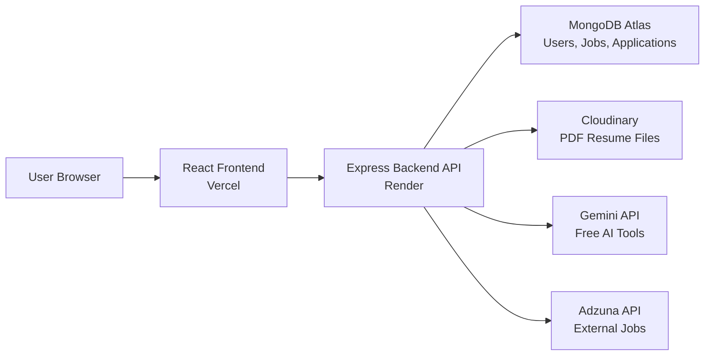

### Simple Explanation

The frontend is what the user sees.

The backend is the server that receives requests, checks login, talks to the database, uploads resumes, and calls APIs.

MongoDB stores app data.

Cloudinary stores PDF files.

Gemini gives AI responses.

Adzuna gives live external jobs.

---

## 3. What MERN Means

MERN means:

| Letter | Meaning | Use In This Project |
| --- | --- | --- |
| M | MongoDB | Stores users, jobs, applications |
| E | Express.js | Creates backend API routes |
| R | React.js | Builds frontend pages/components |
| N | Node.js | Runs the backend server |

Interview answer:

> MERN is a full-stack JavaScript stack. React handles the frontend, Express and Node handle the backend API, and MongoDB stores data.

---

## 4. Folder Structure

```text
job portal/
  frontend/
    src/
      components/
      utils/
      constants/
    package.json
    vercel.json

  backend/
    controllers/
    routes/
    models/
    middlewares/
    services/
    constants/
    app.js
    server.js

  docs/
    PROJECT_LEARNING_GUIDE.md

  README.md
  render.yaml
```

### What Each Backend Folder Means

| Folder/File | Meaning |
| --- | --- |
| `backend/server.js` | Starts the backend server |
| `backend/app.js` | Sets up Express, CORS, cookies, routes, file upload |
| `backend/routes/` | Defines API URLs |
| `backend/controllers/` | Contains main logic for each route |
| `backend/models/` | Defines MongoDB schemas |
| `backend/middlewares/` | Common checks like login and error handling |
| `backend/services/` | Reusable helper logic like resume upload |
| `backend/constants/` | Fixed values like roles, statuses, job types |

### What Each Frontend Folder Means

| Folder/File | Meaning |
| --- | --- |
| `frontend/src/App.jsx` | Defines frontend routes/pages |
| `frontend/src/main.jsx` | Starts React app |
| `frontend/src/components/` | UI pages and reusable components |
| `frontend/src/utils/api.js` | Axios API setup |
| `frontend/src/constants/` | Fixed frontend options |

---

## 5. Request Lifecycle

Whenever the user clicks something, this usually happens:

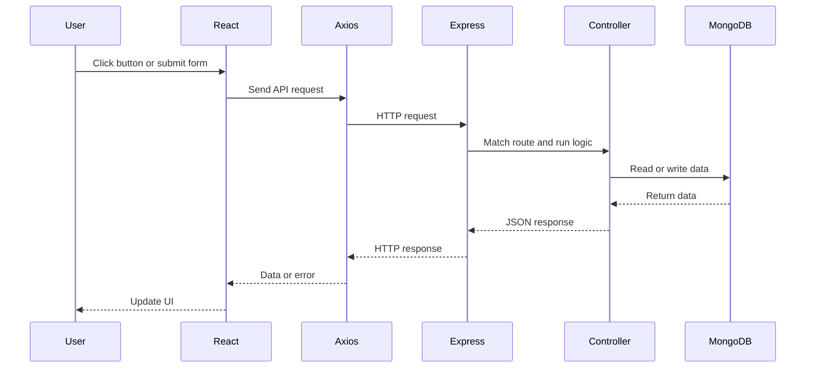

Example:

When a job seeker applies for a job:

1. User fills the application form.
2. React sends data to backend.
3. Backend checks if user is logged in.
4. Backend checks if job exists.
5. Backend saves application in MongoDB.
6. Frontend shows success toast.

---

## 6. Important Concepts You Must Know

### API

API means Application Programming Interface.

In this project, API means backend URLs that frontend calls.

Example:

```text
POST /api/v1/user/login
GET /api/v1/job/getall
POST /api/v1/application/post
```

Interview answer:

> The frontend does not directly access MongoDB. It calls backend API endpoints, and the backend performs database operations.

### Route

A route is an API path.

Example:

```js
router.post("/login", login);
```

This means:

```text
POST /api/v1/user/login
```

calls the `login` controller.

### Controller

A controller contains the actual backend logic.

Example:

`userController.js` handles:

- register
- login
- logout
- get user
- update profile
- upload resume

### Model

A model defines what data looks like in MongoDB.

Example:

User model defines:

- name
- email
- phone
- password
- role
- resume
- profile

### Middleware

Middleware runs before the controller.

Example:

`isAuthenticated` checks if the user is logged in before allowing protected routes.

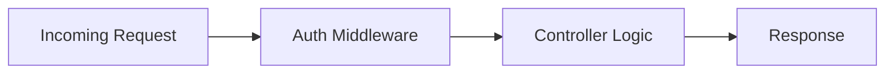

### JWT

JWT means JSON Web Token.

It proves that the user is logged in.

Flow:

1. User logs in.
2. Backend creates JWT.
3. JWT is stored in an HTTP-only cookie.
4. For protected routes, backend reads cookie and verifies JWT.

### HTTP-only Cookie

A cookie stores the login token in the browser.

HTTP-only means JavaScript cannot read it directly. This is safer than storing tokens in localStorage.

### bcrypt

bcrypt is used to hash passwords.

The app never stores the real password. It stores a hashed password.

Example:

```text
Real password: Saurav123
Stored password: $2b$10$...
```

### CORS

CORS controls which frontend domains can call the backend.

Why needed:

Frontend is on Vercel.

Backend is on Render.

They are different domains, so backend must allow frontend origin.

### Environment Variables

Environment variables store secrets and configuration.

Examples:

```text
DB_URL
JWT_SECRET_KEY
CLOUDINARY_API_SECRET
GEMINI_API_KEY
ADZUNA_APP_KEY
```

Never commit real secrets to GitHub.

---

## 7. Authentication Flow

### Login Visual

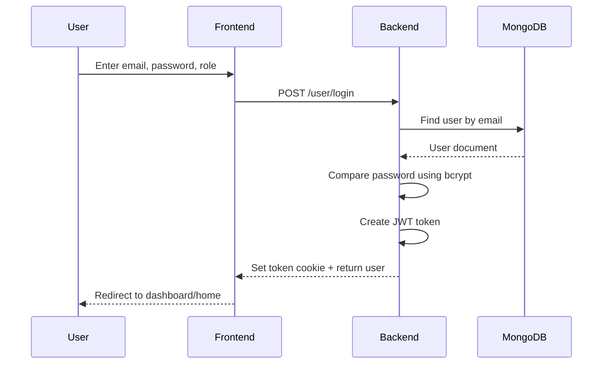

### Files Involved

| Step | File |
| --- | --- |
| Login form | `frontend/src/components/Auth/Login.jsx` |
| Axios setup | `frontend/src/utils/api.js` |
| User route | `backend/routes/userRoutes.js` |
| Login logic | `backend/controllers/userController.js` |
| JWT cookie | `backend/utils/jwtToken.js` |
| Auth middleware | `backend/middlewares/auth.js` |
| User model | `backend/models/userSchema.js` |

### Interview Answer

> When a user logs in, the frontend sends email, password, and role to the backend. The backend finds the user in MongoDB, compares the password using bcrypt, creates a JWT token, and stores it in an HTTP-only cookie. Protected routes verify this cookie before giving access.

---

## 8. Role-Based Access

There are two roles:

```text
Job Seeker
Employer
```

### Job Seeker Can

- Search jobs
- Upload resume
- Apply to jobs
- Track application status
- Use AI placement tools

### Employer Can

- Post jobs
- See own posted jobs
- View applications
- Open resume link
- Update application status
- Use AI candidate summary

### Role Logic Visual

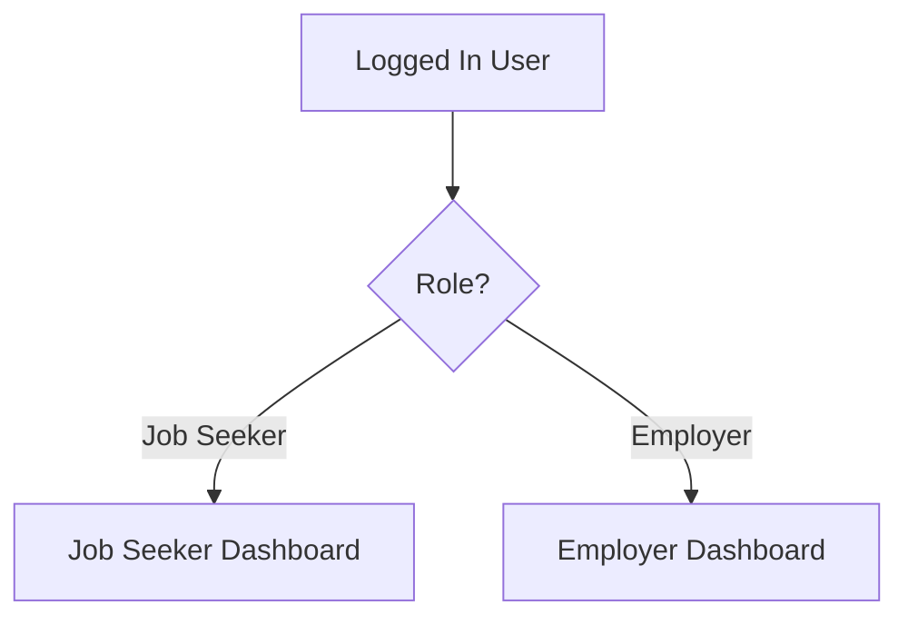

Interview answer:

> The project uses role-based access. The backend checks `req.user.role` before allowing job posting, resume upload, application submission, or employer dashboard access.

---

## 9. Database Models

### Database Visual

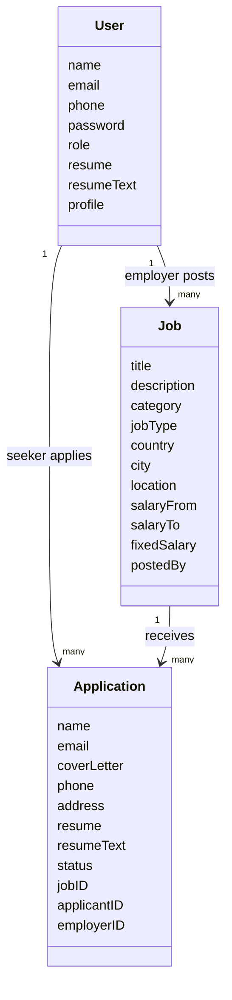

### User Model

File:

```text
backend/models/userSchema.js
```

Stores:

- user identity
- login details
- role
- profile
- resume link
- extracted resume text

### Job Model

File:

```text
backend/models/jobSchema.js
```

Stores:

- job details
- job type
- salary
- city/country
- employer who posted the job

### Application Model

File:

```text
backend/models/applicationSchema.js
```

Stores:

- applicant details
- selected job
- employer
- resume
- current status

---

## 10. Job Search And Filter

### Feature

Job seekers can filter jobs by:

- search keyword
- job type
- location
- salary range

### Files

| Part | File |
| --- | --- |
| Frontend jobs page | `frontend/src/components/Job/Jobs.jsx` |
| Backend route | `backend/routes/jobRoutes.js` |
| Backend logic | `backend/controllers/jobController.js` |
| Job model | `backend/models/jobSchema.js` |

### Flow

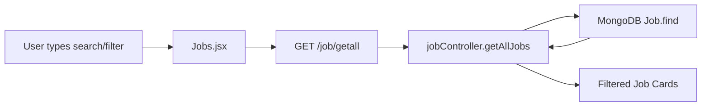

### Interview Answer

> Job filtering is implemented by sending query parameters from the frontend to the backend. The backend builds a MongoDB query based on search text, job type, location, and salary range, then returns matching jobs.

Example:

```text
GET /api/v1/job/getall?search=mern&jobType=Internship&location=Pune, India&salaryRange=0-30000
```

---

## 11. Resume Upload

### What Happens

1. Job seeker selects a PDF.
2. Frontend sends it as `FormData`.
3. Backend validates PDF type and size.
4. Backend extracts text from PDF.
5. Backend uploads PDF to Cloudinary.
6. Backend saves Cloudinary URL and extracted text in MongoDB.

### Resume Upload Visual

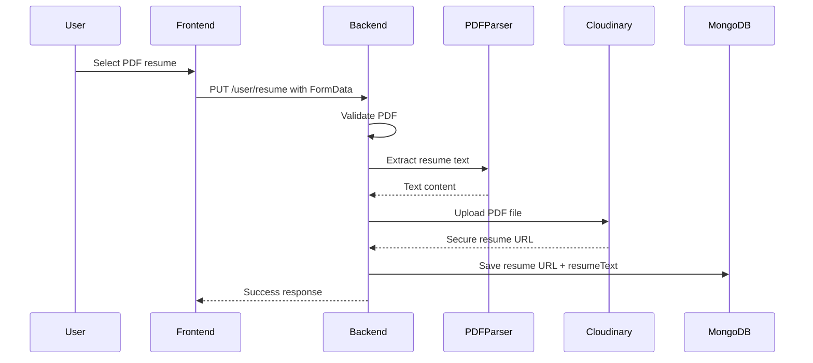

### Files

| Part | File |
| --- | --- |
| Dashboard upload UI | `frontend/src/components/Application/MyApplications.jsx` |
| User route | `backend/routes/userRoutes.js` |
| Upload controller | `backend/controllers/userController.js` |
| Resume service | `backend/services/resumeService.js` |
| User model | `backend/models/userSchema.js` |

### Key Concepts

`FormData` is used for file upload.

`express-fileupload` receives the file in backend.

`pdf-parse` extracts text from the PDF.

Cloudinary stores the actual PDF file.

MongoDB stores:

```text
resume.url
resume.public_id
resumeText
```

### Important Limitation

Text extraction works for normal text-based PDFs.

If the PDF is image-only or scanned, it needs OCR. This project does not use OCR.

Interview answer:

> Resume upload uses express-fileupload to receive a PDF, pdf-parse to extract text, Cloudinary to store the file, and MongoDB to store the resume URL and extracted text for AI analysis.

---

## 12. Applying To A Job

### Flow

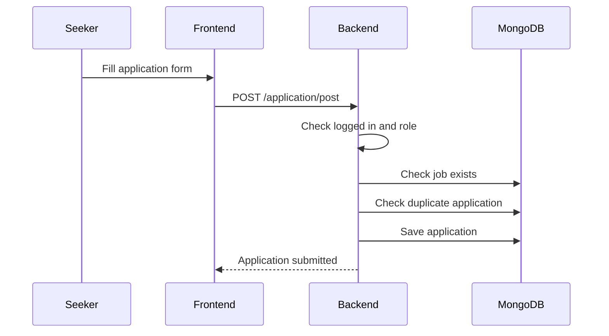

### Files

| Part | File |
| --- | --- |
| Application form | `frontend/src/components/Application/Application.jsx` |
| Application route | `backend/routes/applicationRoutes.js` |
| Controller | `backend/controllers/applicationController.js` |
| Application model | `backend/models/applicationSchema.js` |

### Interview Answer

> When a job seeker applies, the backend checks authentication, validates fields, checks that the job exists, prevents duplicate applications, and saves the application with applicant ID, employer ID, job ID, resume link, and status.

---

## 13. Application Status Tracking

Application statuses:

```text
Pending
Shortlisted
Rejected
```

### Status Visual

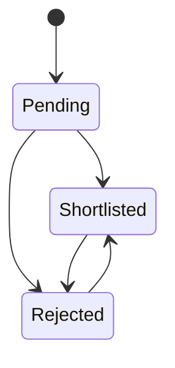

### Flow

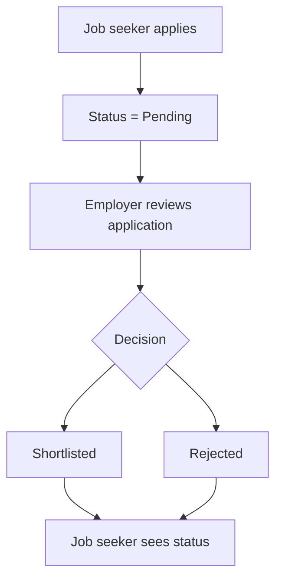

### Interview Answer

> Every application has a status field. By default it is Pending. Employers can update it to Shortlisted or Rejected, and the job seeker dashboard reads these applications to show current status counts.

---

## 14. Dashboards

### Job Seeker Dashboard

Shows:

- total applications
- pending applications
- shortlisted applications
- rejected applications
- list of applied jobs
- resume upload
- resume analysis

Main frontend file:

```text
frontend/src/components/Application/MyApplications.jsx
```

Backend route:

```text
GET /api/v1/application/jobseeker/dashboard
```

### Employer Dashboard

Shows:

- total jobs posted
- total applications received
- posted jobs
- application count per job
- employer applications
- candidate resume links

Backend route:

```text
GET /api/v1/job/employer/dashboard
```

### Dashboard Visual

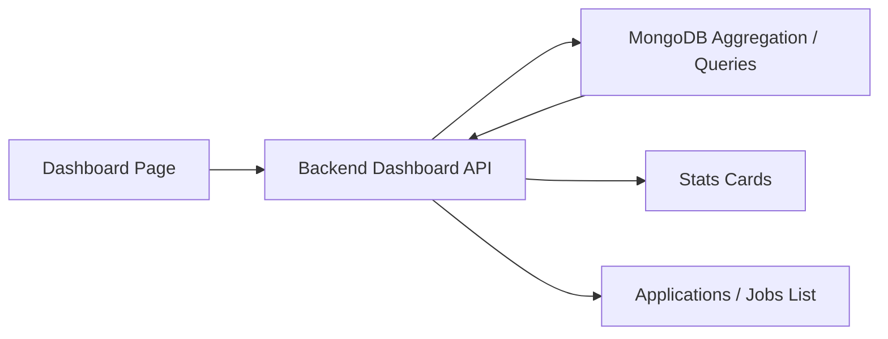

---

## 15. AI Features

The project uses Gemini API free tier.

If Gemini is missing or fails, the app uses built-in smart fallback logic.

### AI Features List

| Feature | User |
| --- | --- |
| Career advice | Job seeker |
| Resume analysis | Job seeker |
| Job match | Job seeker |
| Cover letter | Job seeker |
| Interview questions | Job seeker |
| Skill roadmap | Job seeker |
| Candidate summary | Employer |
| Job description draft | Employer |

### AI Visual

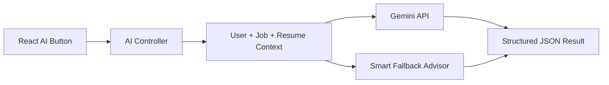

### What Is Context?

AI needs useful input. The backend creates context using:

- user profile
- resume text
- job title
- job description
- job skills/category
- application cover letter

Example:

```text
Candidate skills: React, Node.js, MongoDB
Target role: MERN Intern
Job description: Build React dashboards and APIs
```

### Why Structured JSON?

AI responses should be predictable.

Instead of random text, backend asks Gemini to return fields like:

```text
summary
matchScore
strengths
gaps
nextSteps
```

This makes it easier for React to display the result in cards/lists.

### Interview Answer

> I integrated Gemini API for placement-focused AI tools. The backend builds structured context from user profile, resume text, and job data, sends it to Gemini, validates the JSON response, and returns it to the frontend. If Gemini is unavailable, the app uses built-in smart fallback logic.

---

## 16. External Jobs API

The app has internal jobs and external jobs.

### Internal Jobs

Posted by employers using this app.

Stored in MongoDB.

### External Jobs

Fetched from Adzuna API.

Not stored in MongoDB.

### Visual

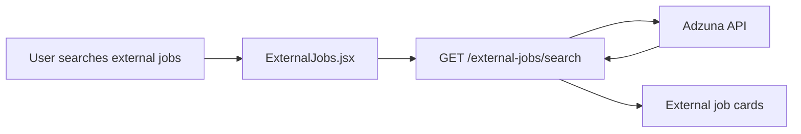

Interview answer:

> External jobs are fetched from Adzuna using backend API credentials. The backend normalizes Adzuna results and sends them to the frontend. These jobs are not saved in MongoDB.

---

## 17. Deployment

### Deployment Visual

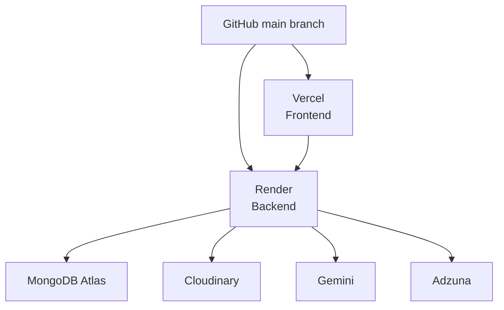

### Frontend Deployment

Platform:

```text
Vercel
```

Root directory:

```text
frontend
```

Important environment variable:

```text
VITE_API_URL=https://job-portal-ftw4.onrender.com/api/v1
```

### Backend Deployment

Platform:

```text
Render
```

Root directory:

```text
backend
```

Important environment variables:

```text
DB_URL
JWT_SECRET_KEY
FRONTEND_URL
COOKIE_SAME_SITE
COOKIE_SECURE
CLOUDINARY_CLOUD_NAME
CLOUDINARY_API_KEY
CLOUDINARY_API_SECRET
GEMINI_API_KEY
ADZUNA_APP_ID
ADZUNA_APP_KEY
```

### Interview Answer

> I deployed the React frontend on Vercel and the Express backend on Render. MongoDB Atlas is used for database, Cloudinary for resume storage, Gemini for AI, and environment variables are configured separately on deployment platforms.

---

## 18. Important APIs To Know

### User APIs

| Method | Endpoint | Use |
| --- | --- | --- |
| POST | `/user/register` | Create user |
| POST | `/user/login` | Login |
| GET | `/user/logout` | Logout |
| GET | `/user/getuser` | Get current user |
| PUT | `/user/profile` | Update profile |
| PUT | `/user/resume` | Upload resume |

### Job APIs

| Method | Endpoint | Use |
| --- | --- | --- |
| GET | `/job/getall` | Get/search/filter jobs |
| POST | `/job/post` | Employer posts job |
| GET | `/job/getmyjobs` | Employer gets own jobs |
| GET | `/job/employer/dashboard` | Employer dashboard |
| GET | `/job/:id` | Single job |
| PUT | `/job/update/:id` | Update job |
| DELETE | `/job/delete/:id` | Delete job |

### Application APIs

| Method | Endpoint | Use |
| --- | --- | --- |
| POST | `/application/post` | Apply to job |
| GET | `/application/employer/getall` | Employer applications |
| PUT | `/application/employer/status/:id` | Update status |
| GET | `/application/jobseeker/dashboard` | Job seeker dashboard |
| GET | `/application/jobseeker/getall` | Job seeker applications |
| DELETE | `/application/delete/:id` | Delete own application |

### AI APIs

| Method | Endpoint | Use |
| --- | --- | --- |
| POST | `/ai/career-advice` | Career advice |
| POST | `/ai/resume-analysis` | Analyze resume |
| GET | `/ai/job-match/:id` | Job match |
| POST | `/ai/cover-letter/:id` | Cover letter |
| GET | `/ai/interview-questions/:id` | Interview questions |
| GET | `/ai/skill-roadmap/:id` | Skill roadmap |
| GET | `/ai/application-summary/:id` | Employer candidate summary |
| POST | `/ai/job-description` | AI job description |

---

## 19. How To Explain The Project In Interview

Use this answer:

> My project is a MERN stack job portal. It has two roles: job seeker and employer. Job seekers can search jobs, upload resumes, apply for jobs, track application status, and use AI tools for resume analysis, job match, cover letters, interview questions, and skill roadmaps. Employers can post jobs, view applications, open Cloudinary-hosted resumes, update application status, and generate AI candidate summaries. The frontend is built with React and Tailwind CSS. The backend is built with Express and MongoDB using Mongoose. Authentication uses JWT stored in HTTP-only cookies. Resume PDFs are uploaded to Cloudinary and text is extracted using pdf-parse. AI uses Gemini API free tier with fallback logic. The frontend is deployed on Vercel and backend on Render.

Short version:

> It is a role-based MERN job portal with job posting, applications, resume upload, dashboards, status tracking, Gemini AI placement tools, and deployment on Vercel/Render.

---

## 20. Resume Points

Use these bullets:

```text
JobPortal - MERN Stack Job Portal Application
- Developed a role-based job portal using React, Node.js, Express.js, MongoDB, and Tailwind CSS.
- Implemented JWT authentication with HTTP-only cookies and protected routes for job seekers and employers.
- Built job search and filtering by keyword, job type, location, and salary range.
- Added PDF resume upload using Cloudinary and resume text extraction using pdf-parse.
- Created job seeker and employer dashboards with application status tracking.
- Integrated Gemini API for resume analysis, job matching, cover letter generation, interview questions, and skill roadmaps.
- Integrated Adzuna API to fetch live external job listings.
- Deployed frontend on Vercel and backend on Render with MongoDB Atlas.
```

If you want a shorter resume version:

```text
Built a MERN stack job portal with role-based authentication, job posting, applications, resume upload, dashboards, Gemini AI placement tools, Adzuna live jobs, and deployment on Vercel/Render.
```

---

## 21. Interview Questions And Answers

### Q1. What is the purpose of this project?

Answer:

> The purpose is to connect job seekers and employers. Job seekers can apply for jobs and track status. Employers can post jobs and manage applications. The project also includes AI placement tools using Gemini.

### Q2. Why did you use MongoDB?

Answer:

> MongoDB is flexible for storing users, jobs, applications, profiles, resume links, and changing data structures. Mongoose helps define schemas and relationships.

### Q3. How does authentication work?

Answer:

> Authentication uses JWT. After login, the backend verifies email/password, creates a token, and stores it in an HTTP-only cookie. Protected routes use middleware to verify the token.

### Q4. Why use bcrypt?

Answer:

> bcrypt hashes passwords before storing them, so real passwords are never saved in MongoDB.

### Q5. What are protected routes?

Answer:

> Protected routes require a logged-in user. The backend verifies JWT, and the frontend redirects unauthenticated users to login.

### Q6. How does resume upload work?

Answer:

> The frontend sends the PDF as FormData. The backend validates it, extracts text using pdf-parse, uploads the PDF to Cloudinary, and stores the Cloudinary URL plus extracted text in MongoDB.

### Q7. Why use Cloudinary?

Answer:

> Cloudinary provides cloud storage for uploaded resume PDFs. This avoids storing files directly on the server, which is important because Render free services do not provide reliable persistent file storage.

### Q8. How does job filtering work?

Answer:

> The frontend sends filter values as query parameters. The backend builds a MongoDB query using search regex, job type, location, and salary range, then returns matching jobs.

### Q9. How does application status tracking work?

Answer:

> Each application has a status field. It starts as Pending. Employers can update it to Shortlisted or Rejected. The job seeker dashboard reads application counts by status.

### Q10. How does AI work?

Answer:

> The backend prepares structured context from profile, resume text, job data, or application data. It sends that to Gemini and asks for JSON output. If Gemini fails, built-in fallback logic returns useful results.

### Q11. What is fallback logic?

Answer:

> Fallback logic is local code that generates simple advice or analysis when the AI provider is unavailable. It keeps the app usable even if the API key is missing or the provider fails.

### Q12. What is CORS?

Answer:

> CORS controls which frontend domain can call the backend. Since Vercel and Render use different domains, the backend must allow the Vercel frontend URL.

### Q13. What was one challenge?

Answer:

> One challenge was reliable resume PDF text extraction. The parser had to work with normal text PDFs, and the backend also needed fallback behavior if text extraction failed.

### Q14. What would you improve?

Answer:

> I would add admin moderation, better search ranking, email notifications, interview scheduling, OCR for scanned resumes, and analytics for employers.

---

## 22. Concepts To Learn In Order

Do not try to learn everything randomly. Learn in this order:

1. HTML, CSS, JavaScript basics
2. React components, state, props
3. React Router
4. Axios API calls
5. Node.js and Express
6. REST API methods: GET, POST, PUT, DELETE
7. MongoDB and Mongoose schemas
8. JWT authentication
9. Cookies and protected routes
10. File upload with FormData
11. Cloudinary
12. API integration: Gemini and Adzuna
13. Deployment: Vercel, Render, MongoDB Atlas

---

## 23. Seven-Day Placement Preparation Plan

### Day 1: Understand The App

Goal:

- Know what the project does.
- Understand user roles.
- Run frontend and backend.

Practice:

- Explain project in 2 minutes.
- Draw architecture from memory.

### Day 2: Frontend

Study:

- `App.jsx`
- `Login.jsx`
- `Register.jsx`
- `Jobs.jsx`
- `MyApplications.jsx`

Practice:

- Explain React component.
- Explain how form submission works.
- Explain Axios call.

### Day 3: Backend Routes And Controllers

Study:

- `userRoutes.js`
- `jobRoutes.js`
- `applicationRoutes.js`
- `userController.js`
- `jobController.js`
- `applicationController.js`

Practice:

- Explain route to controller flow.
- Explain one full API from request to response.

### Day 4: Database

Study:

- `userSchema.js`
- `jobSchema.js`
- `applicationSchema.js`

Practice:

- Draw model relationships.
- Explain why `postedBy`, `jobID`, `applicantID`, and `employerID` exist.

### Day 5: Authentication

Study:

- `jwtToken.js`
- `auth.js`
- login/register controller

Practice:

- Explain JWT.
- Explain HTTP-only cookie.
- Explain role-based access.

### Day 6: Resume Upload And AI

Study:

- `resumeService.js`
- `aiController.js`

Practice:

- Explain PDF upload flow.
- Explain Gemini AI flow.
- Explain fallback logic.

### Day 7: Deployment And Mock Interview

Study:

- Vercel settings
- Render settings
- environment variables

Practice:

- Demo project.
- Answer 15 interview questions.
- Explain one bug and how it was fixed.

---

## 24. Demo Script For Interview

Follow this order:

1. Open homepage.
2. Register/login as employer.
3. Post a job.
4. Show employer dashboard.
5. Register/login as job seeker.
6. Search/filter jobs.
7. Upload resume.
8. Run resume analysis.
9. Apply to job.
10. Login as employer.
11. View application and resume.
12. Update status to Shortlisted.
13. Login as job seeker.
14. Show dashboard status changed.
15. Show AI career advice or job match.

What to say during demo:

> This shows the full flow from job posting to application tracking, including resume upload, role-based access, and AI placement support.

---

## 25. One Complete Example: Login API

### Frontend

User enters email/password in:

```text
frontend/src/components/Auth/Login.jsx
```

Frontend sends:

```text
POST /api/v1/user/login
```

### Backend Route

```text
backend/routes/userRoutes.js
```

The route calls:

```text
login controller
```

### Backend Controller

```text
backend/controllers/userController.js
```

The controller:

1. validates email/password/role
2. finds user in MongoDB
3. compares password using bcrypt
4. checks role
5. creates JWT
6. sends cookie

### Response

Frontend receives:

```text
success: true
user: {...}
message: User logged in successfully.
```

Then frontend updates app state and redirects user.

---

## 26. One Complete Example: Resume Upload API

### Frontend

File:

```text
frontend/src/components/Application/MyApplications.jsx
```

Sends:

```text
PUT /api/v1/user/resume
```

with `FormData`.

### Backend

Route:

```text
backend/routes/userRoutes.js
```

Controller:

```text
backend/controllers/userController.js
```

Service:

```text
backend/services/resumeService.js
```

### Backend Steps

1. Check user is job seeker.
2. Check PDF exists.
3. Validate file type and size.
4. Extract PDF text.
5. Upload PDF to Cloudinary.
6. Save URL and text in MongoDB.

### Interview Answer

> Resume upload is separated into controller and service logic. The controller handles request/response and user authorization. The service handles validation, text extraction, Cloudinary upload, and cleanup.

---

## 27. What You Should Not Say

Do not say:

> I built the whole thing from scratch without help.

Do not say:

> I know every line perfectly.

Better answer:

> I developed and customized this MERN job portal, integrated important features, debugged deployment/API issues, and studied the architecture so I can explain the flow clearly.

This is honest and still strong.

---

## 28. Strong Final Interview Pitch

Memorize this:

> JobPortal is a full-stack MERN application built for placement workflows. It supports two roles: job seeker and employer. Job seekers can search and filter jobs, upload a PDF resume, apply for jobs, track status, and use Gemini AI tools for resume analysis, job matching, cover letters, interview questions, and skill roadmaps. Employers can post jobs, view candidate applications and resumes, update statuses, and generate AI candidate summaries. The backend uses Express, MongoDB, JWT authentication, Cloudinary file storage, and Gemini API. The frontend uses React, Tailwind CSS, React Router, Axios, and toast notifications. It is deployed using Vercel for frontend and Render for backend.

---

## 29. Quick Revision Sheet

```text
Frontend = React UI
Backend = Express API
Database = MongoDB
Model = Data structure
Route = API URL
Controller = Logic
Middleware = Runs before controller
JWT = Login proof
Cookie = Stores JWT
bcrypt = Password hashing
CORS = Allows frontend to call backend
Cloudinary = Stores PDF resumes
pdf-parse = Extracts text from PDF
Gemini = Free AI provider
Adzuna = External jobs API
Vercel = Frontend deployment
Render = Backend deployment
```

---

## 30. Practice Task

To prove you understand this project, explain these without looking:

1. What happens when a user logs in?
2. What happens when a job seeker uploads a resume?
3. What happens when a job seeker applies to a job?
4. How does employer update status?
5. How does job search filter work?
6. How does Gemini AI get context?
7. What is stored in MongoDB?
8. What is stored in Cloudinary?
9. Why do we need CORS?
10. How is the app deployed?

If you can answer these 10 questions, you can discuss this project in placement interviews.

